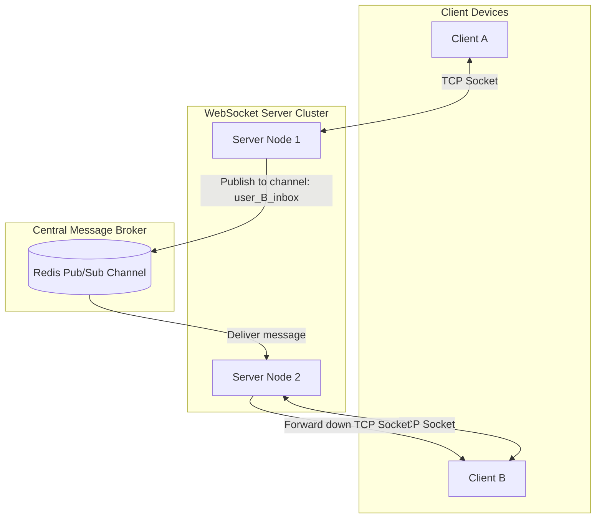

# Backend Systems: WebSocket Architecture & Connection Scale

This document details the connection lifecycle, load-balancing mechanisms, state synchronization via pub/sub message brokers, and scale strategies for full-duplex WebSockets.

---

## 1. Connection Lifecycle & HTTP Handshake

WebSockets operate over standard TCP connections. To establish a connection, the client initiates an HTTP request containing upgrade headers. The server accepts and returns an `HTTP 101 Switching Protocols` handshake response:

```
Client                                                  Server
  |                                                       |
  |--- GET /chat HTTP/11 -------------------------------->|
  |    Connection: Upgrade                                |
  |    Upgrade: websocket                                 |
  |    Sec-WebSocket-Key: dGhlIHNhbXBsZSBub25jZQ==        |
  |                                                       |
  |<-- HTTP/1.1 101 Switching Protocols ------------------|
  |    Connection: Upgrade                                |
  |    Upgrade: websocket                                 |
  |    Sec-WebSocket-Accept: s3pPLMBiTxaQ9kYGzzhZRbK+xOo= |
  |                                                       |
  |========= FULL-DUPLEX TCP SOCKET TRANSFERS ACTIVE =====|
```

---

## 2. Horizontal Scaling & The Pub/Sub Broker

Unlike stateless REST endpoints, WebSocket connections are stateful. The physical TCP socket handle is retained in the memory heap of the specific server node that accepted the handshake.

### The Scale Challenge
If `Client A` is connected to `Server Node 1` and wants to send a direct message to `Client B`, but `Client B` is connected to `Server Node 2`:
* `Server Node 1` cannot directly write to `Client B`'s socket because that memory socket reference resides on `Server Node 2`'s heap.

### The Solution: Redis Pub/Sub Synchronization
To route messages across server instances, we connect the servers to a central **Publish/Subscribe Message Broker** (e.g. Redis, RabbitMQ):



1. Every server node subscribes to a unique message channel for each user session it currently hosts (e.g., `Server Node 2` subscribes to the channel `user_B_inbox` on Redis).
2. When `Client A` sends a message to `Client B` via `Server Node 1`:
   * `Server Node 1` serializes the payload and publishes it to the Redis channel: `user_B_inbox`.
   * Redis broadcasts the message to all subscribers.
   * `Server Node 2` (which is subscribed to `user_B_inbox`) receives the broadcast payload and writes it down the physical TCP socket connection to `Client B`.

---

## 3. Connection Load Balancing & Sticky Sessions

Standard HTTP load balancers distribute requests round-robin. However, for WebSockets:
* **Upgrade Intercept**: The Load Balancer (e.g. NGINX, HAProxy, AWS ALB) must be configured to recognize the HTTP upgrade request and maintain persistent TCP tunnels.
* **Sticky Sessions**: During the handshake, the load balancer maps the client's session to a specific server node. Subsequent connection retries from the client are directed to the same node to prevent connection instability.

---

## 4. Heartbeats & Socket Pruning (Ping/Pong)

Mobile clients suffer silent connection drops (e.g., entering a tunnel, switching Wi-Fi networks). The TCP socket remains open on the server side (half-open socket), wasting memory.
* **Ping/Pong Frames**: The server periodically sends a low-overhead control frame (`Ping`) down all active sockets.
* **Timeout Pruning**: If the client fails to return a response frame (`Pong`) within a set timeout limit (e.g., 30 seconds), the server closes the socket, frees resources, and flags the user session as offline in the DB.
