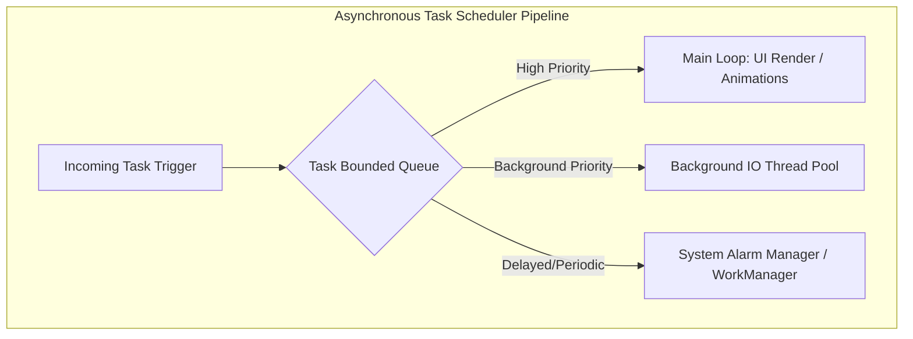

# Asynchronous Task Scheduler

## 1. Context and Problem Statement
When writing highly responsive mobile clients, we frequently execute tasks that require different scheduling strategies:
* **Immediate execution**: Run now on the current thread (e.g. updating UI values).
* **Deferred execution**: Run in the background at a later time (e.g. syncing local outboxes).
* **Periodic execution**: Run at regular intervals (e.g. fetching config details every 1 hour).

Executing all of these tasks synchronously halts the application's rendering frame loops. We require an **Asynchronous Task Scheduler** that manages work streams without starving the main execution thread.

---

## 2. Dynamic Scheduling Architectures

### 1. The Main Event Thread (Looper)
Mobile apps run an execution loop (`Looper` on Android, `Event Loop` in Dart). This loop constantly checks for incoming paint events, taps, and timers. Heavy operations inside this loop starve the rendering engine, dropping frame rates.

### 2. Thread Pools & Worker Queues
To offload tasks, we implement thread-safe job queues. When a heavy operation is scheduled, the worker pool grabs a thread from its pool, executes the operation, and posts the results back to the main thread's message queue, protecting screen responsiveness.

---

## 3. Real-World Mobile Relevance

### 1. Background File Uploads & Downloads
* Spawning file uploads directly in active view controllers leaks memory if the user navigates away. The task scheduler receives these tasks, registers them inside a persistent local queue, and handles them in a background thread context.

### 2. API Periodic Sync Systems
* Telemetry engines register periodic logs to execute even when the application is completely terminated, interacting directly with system alarm dispatchers to optimize battery life.

---

## 4. Complexity & Tradeoffs

* **Scheduling Time Complexity:** $O(\log N)$ when using a binary heap priority queue to schedule tasks based on execution time.
* **Execution Time Complexity:** $O(1)$ to dispatch ready tasks.
* **Tradeoffs:** Heavy multi-threaded schedulers require complex synchronization locks. In Dart's single-threaded environment, we trade multi-threading locks for loop scheduling, reducing code footprint but limiting operations to one core unless isolates are explicitly spawned.
