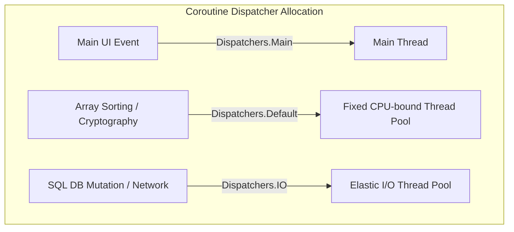

# Kotlin Coroutine Dispatchers & Thread Boundaries

## 1. Cooperative Multitasking on the JVM
Unlike traditional threading models where the operating system preemptively context-switches threads, Kotlin Coroutines execute via **cooperative multitasking**. 

A coroutine can **suspend** its execution at designated suspension points (like making a network request or reading a file). During suspension, the coroutine releases its active worker thread, allowing the thread to run other concurrent tasks. Once the suspended call completes, the coroutine resumes execution on a designated dispatcher thread.

---

## 2. The Core Dispatchers

Kotlin provides specific dispatchers optimized for different task workloads:

| Dispatcher | Thread Pool Strategy | Primary Use Cases |
| :--- | :--- | :--- |
| **`Dispatchers.Main`** | Bound to the platform's UI/Main Thread (e.g. Android Looper). | UI rendering, layout updates, button clicks. |
| **`Dispatchers.IO`** | Elastic, high-capacity pool (up to 64 threads or number of CPU cores). | Blocking I/O operations, network hits, DB writes, file access. |
| **`Dispatchers.Default`** | Fixed pool size bound to the number of CPU cores. | CPU-intensive computations, complex JSON parsing, array sorting. |
| **`Dispatchers.Unconfined`** | Executes on the current thread context until the first suspension point. | Advanced library development, event dispatchers. |



---

## 3. Safe Context Switching with `withContext`

When performing operations in clean architecture, we must guarantee that background operations do not block the UI thread, and database mutations run strictly in the background. We transition between dispatchers safely using `withContext`:

```kotlin
class UserRepository(private val localDb: UserDatabase) {

    suspend fun loadUserData(userId: String): UserData = withContext(Dispatchers.IO) {
        // This database query executes safely on the IO thread pool
        val userEntity = localDb.queryUser(userId)
        
        // Switch context back to default for heavy serialization/conversion
        withContext(Dispatchers.Default) {
            transformToDomainModel(userEntity)
        }
    }
}
```
* **Thread Safety**: `withContext` blocks wait for the inner execution block to resolve before returning, behaving like an inline synchronous call without blocking the physical thread stack.
