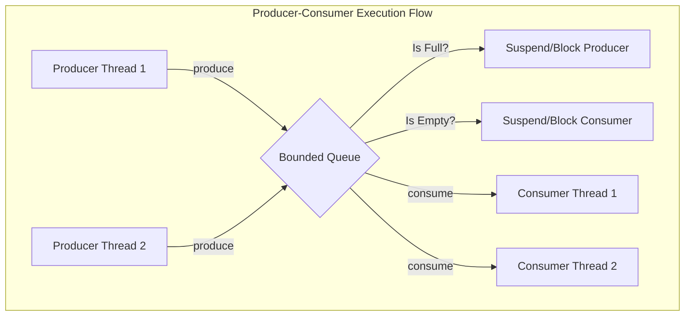

# Thread-Safe Producer-Consumer Queue

## 1. Problem Statement
Design and implement a thread-safe **Producer-Consumer Queue** with a fixed capacity (bounded buffer). 

The class should support:
* `produce(T item)`: Adds an item to the queue. If the queue is at capacity, the producing thread/coroutine must **suspend** or **block** until space becomes available.
* `consume()`: Removes and returns an item from the queue. If the queue is empty, the consuming thread/coroutine must **suspend** or **block** until an item is added.

---

## 2. Design Architecture: Thread Synchronization vs. Event Channels

In mobile systems, managing asynchronous job schedules requires different concurrency primitives depending on the framework:

### Kotlin/JVM: Thread-Safe Blocking/Suspending Buffers
On the JVM, multiple threads execute concurrently with access to shared memory. We solve the bounded-buffer problem using one of two mechanisms:
1. **Reentrant Locks & Condition Variables**: Classical multi-threading. A lock protects the queue's integrity. The `notFull` condition blocks producers when the queue is full, and the `notEmpty` condition blocks consumers when the queue is empty.
2. **Coroutine Channels (`Channel<T>`)**: Under structured concurrency, we use Kotlin's non-blocking Channels. `Channel(capacity)` natively handles suspension when the buffer is full (`send()`) or empty (`receive()`), freeing the underlying thread pool.

### Dart/Flutter: Stream Controllers & Loops
Dart is single-threaded; there are no parallel threads competing for identical heap locations. However, asynchrony is still essential to prevent blocking the UI loop:
* **StreamController**: Act as our asynchronous queue. The Producer posts data to the Sink (`sink.add(item)`). The Consumer listens to the Stream as an asynchronous listener.
* **Isolate Sandboxing**: For heavy calculations, we spawn a separate Isolate, and use **Ports** (`SendPort` / `ReceivePort`) to pass serialized payloads as messages back and forth.

---

## 3. Real-World Mobile Engineering Use Cases

### 1. Unified Background Log Telemetry Batchers
* Telemetry engines batch analytical log payloads locally. High-frequency UI interactions (taps, page loads, scrolls) act as **Producers** writing logs to a thread-safe bounded buffer. A background worker acts as the **Consumer**, pulling entries, bundling them into JSON blocks, and executing upload queries to the server, protecting the main UI thread from network load.

### 2. Live Media Stream Frame Decompressors
* Video decoders stream packets asynchronously. The network receiver acts as the **Producer**, loading raw compressed frames into a bounded queue. The renderer acts as the **Consumer**, pulling frames and writing them to the screen canvas at regular intervals.

---

## 4. Complexity & Tradeoffs

* **Time Complexity:** $O(1)$ constant time for both `produce` and `consume` mutations.
* **Space Complexity:** $O(C)$ where $C$ is the defined buffer capacity.
* **Tradeoffs:** Block-based locking stops the physical OS thread, which wastes resources. Suspend-based mechanisms (like Kotlin Coroutine Channels or Dart Streams) release threads when waiting, yielding superior energy efficiency.

---

## 5. Visual Flowchart

---

## 6. Implementation References

* **Kotlin Implementation:** [`producer_consumer_kotlin.kt`](./producer_consumer_kotlin.kt)
* **Dart Implementation:** [`producer_consumer_dart.dart`](./producer_consumer_dart.dart)
