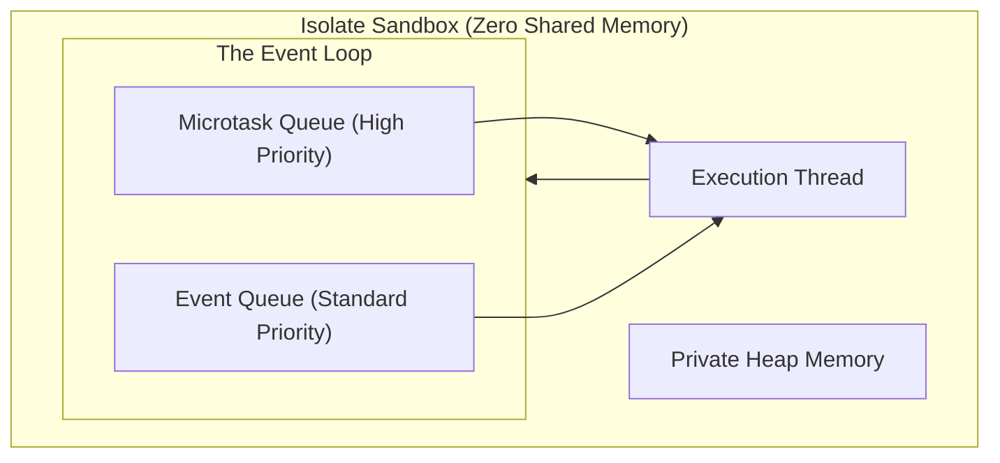
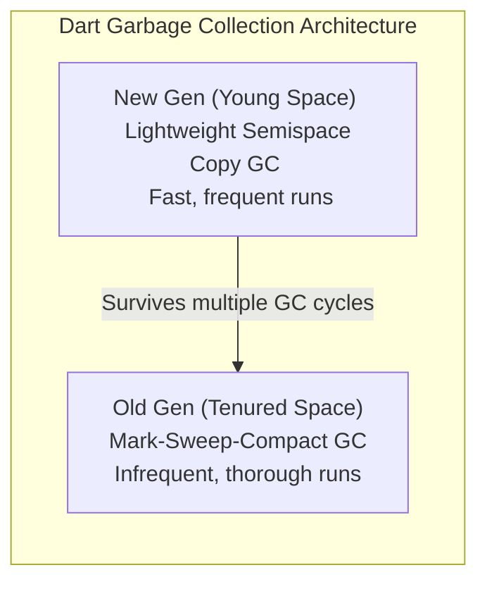

# Dart Runtime Mechanics & Architecture

This document covers Dart's runtime environment, event execution queues, concurrency models, and garbage collection mechanisms, with special focus on how these mechanics dictate the performance of Flutter applications.

---

## 1. Single-Threaded Execution & The Event Loop

Unlike traditional multi-threaded languages (like Java or C#) where threads share memory by default, Dart is a **single-threaded** execution model. Every Dart program runs in a self-contained sandbox called an **Isolate**.

An Isolate has:
1. **Thread of Execution**: Processes instructions sequentially.
2. **Dedicated Heap memory**: No other isolate can directly access or mutate this memory, eliminating race conditions and lock-based synchronization.
3. **Event Loop**: Schedules and processes events.



### Microtask Queue vs. Event Queue
The Event Loop utilizes two distinct queues:
1. **Microtask Queue (Highest Priority)**:
   * Used for short, critical internal operations that must run asynchronously but *as soon as possible* before returning control to the host operating system.
   * Managed via `scheduleMicrotask()`.
   * **Rule**: The event loop will continuously pull from the Microtask Queue until it is completely empty before checking the Event Queue. If a microtask schedules another microtask, it can starve the Event Queue and freeze the application.
2. **Event Queue (Standard Priority)**:
   * Handles external asynchronous actions: network I/O, file system operations, timer completions, pointer events, click inputs, drawing frames, and platform channel messages.

---

## 2. Under the Hood: `async` / `await` Transformation

When you write `async` and `await` in Dart, it is syntactical sugar for standard Future/Stream API chaining. Under the hood, the Dart compiler transforms these methods into a **Finite State Machine (FSM)**:

```dart
Future<void> loadProfile() async {
  print("Loading start");
  final data = await fetchUserData(); // Suspension Point
  print("User details: $data");
}
```

**Compilation Transformation Flow**:
1. When `loadProfile()` is invoked, it runs synchronously until it reaches the first `await` (the **suspension point**).
2. The runtime schedules `fetchUserData()` on the Event Queue.
3. `loadProfile()` immediately pauses, returns a pending `Future<void>` to the caller, and yields control back to the Event Loop.
4. The main thread is free to process other events (like rendering UI frames at 120fps).
5. When `fetchUserData()` completes, its callback (the remainder of the `loadProfile` function) is pushed to the **Microtask Queue** or **Event Queue** to execute as a state resumption.

---

## 3. Multi-Threaded Concurrency: Isolates

For computationally heavy tasks (e.g. JSON parsing of a 10MB payload, heavy image compression, PDF generation), executing them on the main isolate will block the event loop, causing dropped frames (jank).

To run code in parallel, Dart spawns secondary **Isolates**:

```dart
import 'dart:isolate';

void heavyComputation(SendPort sendPort) {
  // Runs on a completely separate OS thread and private heap
  int result = 0;
  for (int i = 0; i < 1000000000; i++) {
    result += i;
  }
  sendPort.send(result);
}

void main() async {
  ReceivePort receivePort = ReceivePort();
  await Isolate.spawn(heavyComputation, receivePort.sendPort);

  receivePort.listen((message) {
    print("Result from background Isolate: $message");
    receivePort.close();
  });
}
```

### Isolate Communication Mechanics
Because isolates do not share memory:
* **Message Passing**: Data sent between isolates is copied from the sender's heap to the receiver's heap in transit.
* **Optimized O(1) Transfers**: If you pass specific unshared buffers (like `TransferableTypedData` or large raw byte arrays) using newer APIs, Dart can *transfer* the heap pointer directly instead of copying, achieving $O(1)$ transfer times.
* **No Locks needed**: Eliminates deadlocks, mutexes, and volatile variable synchronization, yielding robust code.

---

## 4. Memory Management & Generational Garbage Collection

Dart uses an advanced **Generational Garbage Collector** designed specifically for high-frequency object generation in client-side UIs.



### 1. New Generation (Young Space)
* **Design Purpose**: UI frameworks like Flutter generate hundreds of short-lived widgets every time a frame renders (e.g. scroll updates). These objects are created and discarded instantly.
* **Algorithm**: A double-buffered **Semispace Copy collector** (Cheney's Algorithm).
  * The heap is divided into two equal halves (Active vs. Inactive).
  * New objects are allocated sequentially in the Active semispace.
  * When Active space fills up, the GC sweeps it, copies *only surviving* nodes into the Inactive semispace (compacting them sequentially), and flips the active status of the two spaces.
  * **Performance Impact**: Extremely fast ($<1$ms). It only scales with the number of *live* objects, not the size of allocated garbage.

### 2. Old Generation (Tenured Space)
* **Design Purpose**: Objects that survive multiple New Generation collections (e.g., long-lived singletons, image caches, state controllers) are promoted here.
* **Algorithm**: **Mark-Sweep-Compact**.
  * **Mark Phase**: Traverses the graph from root objects and marks all active objects.
  * **Sweep Phase**: Reclaims the memory of unmarked objects.
  * **Compact Phase**: Moves live objects together to prevent memory fragmentation.
  * **Performance Impact**: Slower, as it halts the isolate. However, Dart schedules Old Gen sweeps during idle frame slots provided by the Flutter rendering engine to avoid dropping frames.
