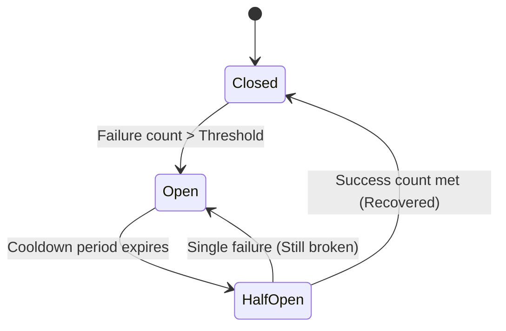

# Distributed Systems Resiliency: The Circuit Breaker

This document details the state machine mechanics, failure thresholds, recovery windows, and complete Kotlin/Dart implementations of the **Circuit Breaker** resilience pattern.

---

## 1. State Machine Mechanics

A Circuit Breaker wraps network calls and protects downstream services from cascading failure by executing transitions across three distinct states:



1. **Closed**:
   * Normal operating state. Requests pass through to the remote service.
   * If the proportion of failed calls (network exceptions, HTTP 5xx errors) crosses a configured threshold (e.g. 5 failures within 10 seconds), the circuit trips and transitions to **Open**.
2. **Open**:
   * The remote service is assumed to be unavailable.
   * All incoming calls fail instantly with a `CallRejectedException`, bypassing the remote network stack completely. This prevents client threads from waiting on timeouts, preserving local capacity.
   * A timer starts tracking the **cooldown period**.
3. **Half-Open**:
   * Once the cooldown timer expires, the circuit enters the **Half-Open** state.
   * The circuit allows a limited trial batch of requests (e.g., 3 requests) to pass through to the remote service.
   * If *any* trial request fails, the circuit assumes the remote service is still down and immediately returns to **Open**, resetting the cooldown timer.
   * If *all* trial requests succeed, the circuit transitions back to **Closed**, returning the system to normal.

---

## 2. Implementation

### Kotlin
```kotlin
import java.util.concurrent.atomic.AtomicInteger
import java.util.concurrent.atomic.AtomicLong
import kotlinx.coroutines.delay

class CallRejectedException(message: String) : Exception(message)

class CircuitBreaker(
    private val failureThreshold: Int = 3,
    private val cooldownMs: Long = 5000
) {
    enum class State { CLOSED, OPEN, HALF_OPEN }

    private var state = State.CLOSED
    private val failureCount = AtomicInteger(0)
    private val successCount = AtomicInteger(0)
    private val lastStateChange = AtomicLong(System.currentTimeMillis())

    @Synchronized
    fun state(): State {
        val now = System.currentTimeMillis()
        if (state == State.OPEN && now - lastStateChange.get() >= cooldownMs) {
            transitionTo(State.HALF_OPEN)
        }
        return state
    }

    @Synchronized
    private fun transitionTo(newState: State) {
        state = newState
        lastStateChange.set(System.currentTimeMillis())
        failureCount.set(0)
        successCount.set(0)
        println("[CircuitBreaker] Transitioned to $newState")
    }

    suspend fun <T> execute(action: suspend () -> T): T {
        val currentState = state()
        if (currentState == State.OPEN) {
            throw CallRejectedException("Circuit is OPEN. Call rejected.")
        }

        return try {
            val result = action()
            onSuccess()
            result
        } catch (e: Exception) {
            onFailure()
            throw e
        }
    }

    @Synchronized
    private fun onSuccess() {
        if (state == State.HALF_OPEN) {
            val count = successCount.incrementAndGet()
            if (count >= 2) { // 2 consecutive successes to close the circuit
                transitionTo(State.CLOSED)
            }
        } else if (state == State.CLOSED) {
            failureCount.set(0)
        }
    }

    @Synchronized
    private fun onFailure() {
        if (state == State.CLOSED) {
            val count = failureCount.incrementAndGet()
            if (count >= failureThreshold) {
                transitionTo(State.OPEN)
            }
        } else if (state == State.HALF_OPEN) {
            // Any failure in half-open trips it back to open
            transitionTo(State.OPEN)
        }
    }
}
```

### Dart
```dart
import 'dart:async';

class CallRejectedException implements Exception {
  final String message;
  CallRejectedException(this.message);

  @override
  String toString() => 'CallRejectedException: $message';
}

enum CircuitState { closed, open, halfOpen }

class CircuitBreaker {
  final int failureThreshold;
  final Duration cooldownDuration;

  CircuitState _state = CircuitState.closed;
  int _failureCount = 0;
  int _successCount = 0;
  DateTime _lastStateChange = DateTime.now();

  CircuitBreaker({
    this.failureThreshold = 3,
    this.cooldownDuration = const Duration(seconds: 5),
  });

  CircuitState get state {
    final now = DateTime.now();
    if (_state == CircuitState.open && now.difference(_lastStateChange) >= cooldownDuration) {
      _transitionTo(CircuitState.halfOpen);
    }
    return _state;
  }

  void _transitionTo(CircuitState newState) {
    _state = newState;
    _lastStateChange = DateTime.now();
    _failureCount = 0;
    _successCount = 0;
    print('[CircuitBreaker] Transitioned to ${newState.toString().split('.').last.toUpperCase()}');
  }

  Future<T> execute<T>(Future<T> Function() action) async {
    if (state == CircuitState.open) {
      throw CallRejectedException('Circuit is OPEN. Call rejected.');
    }

    try {
      final result = await action();
      _onSuccess();
      return result;
    } catch (e) {
      _onFailure();
      rethrow;
    }
  }

  void _onSuccess() {
    if (_state == CircuitState.halfOpen) {
      _successCount++;
      if (_successCount >= 2) { // 2 consecutive successes to close circuit
        _transitionTo(CircuitState.closed);
      }
    } else if (_state == CircuitState.closed) {
      _failureCount = 0;
    }
  }

  void _onFailure() {
    if (_state == CircuitState.closed) {
      _failureCount++;
      if (_failureCount >= failureThreshold) {
        _transitionTo(CircuitState.open);
      }
    } else if (_state == CircuitState.halfOpen) {
      _transitionTo(CircuitState.open);
    }
  }
}
```
