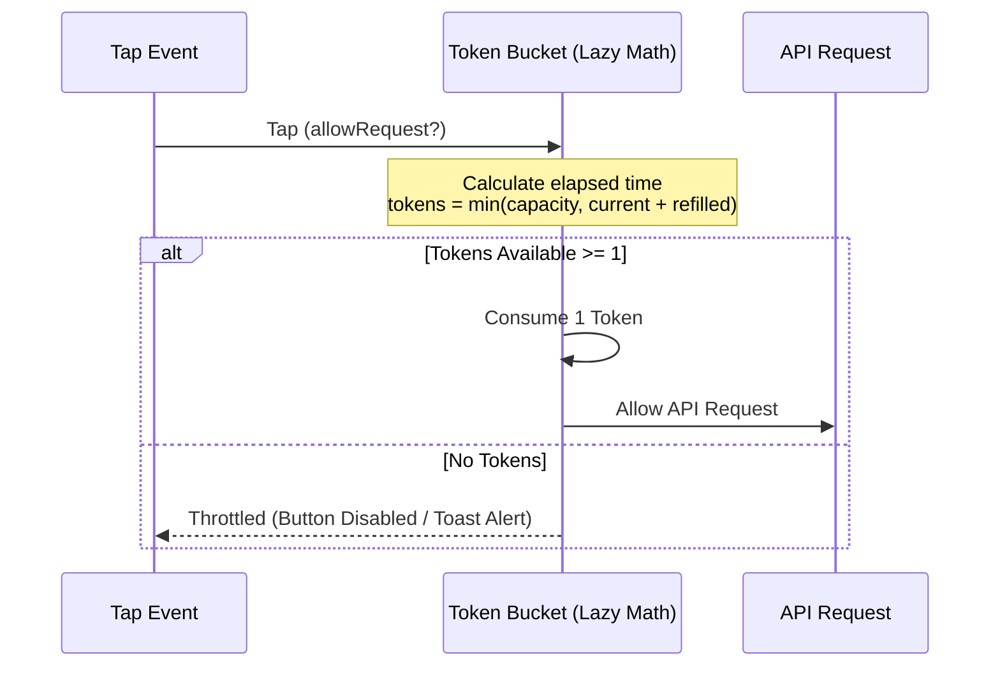

# Token Bucket Rate Limiter

## Pattern
**Token Bucket Algorithm** (Lazy math evaluation for rate throttling).

---

## Problem
Design and implement an efficient, low-overhead client-side **Token Bucket Rate Limiter** that regulates request rates. It must support:
* **`allowRequest(int tokensRequired)`**: Returns `true` if the bucket contains enough tokens to allow the operation, consuming them. Returns `false` otherwise.
* **Dynamic Refilling**: Automatically adds tokens at a fixed rate (e.g., 5 tokens per second) up to a maximum bucket capacity.

---

## Approach
Spinning up a background thread/timer to increment tokens every second drains the mobile CPU and battery. Instead, we utilize **Lazy Dynamic Computation**:
1. Keep track of:
   * `capacity`: The maximum tokens the bucket can hold.
   * `refillRate`: Number of tokens added per second.
   * `tokens`: Current double value representing remaining tokens.
   * `lastRefillTimestamp`: The epoch timestamp (in milliseconds) of the last evaluation.
2. **On Request**:
   * Calculate elapsed time: $elapsed = currentTimestamp - lastRefillTimestamp$.
   * Calculate generated tokens: $newTokens = elapsed \times (refillRate / 1000)$.
   * Update bucket state: $tokens = \min(capacity, tokens + newTokens)$.
   * Update `lastRefillTimestamp = currentTimestamp`.
3. Check if $tokens \ge tokensRequired$.
   * If yes: Subtract $tokensRequired$ from $tokens$ and return `true`.
   * If no: Return `false` without modifying tokens.



---

## Time Complexity
**$O(1)$**: Constant time mathematical check. No loops or iterations.

## Space Complexity
**$O(1)$**: Auxiliary memory used (storing 4 numeric primitives).

---

## Why This Solution Works
By deferring the refilling operation to the exact moment a request arrives, we calculate token replenishment using a single subtraction and multiplication step. This guarantees high precision without needing background threads, protecting mobile resources.

---

## Mobile Engineering Relevance
Mobile apps are extremely prone to redundant actions and excessive network consumption.
* **Double-Tap / Multi-Tap Spam Protection**: Users frequently click buttons (e.g. "Add to Cart", "Like", "Send Message") twice in rapid succession. This can result in duplicated database entries or duplicate charges. A Token Bucket (capacity 1, refill rate 1 per second) placed inside the button click listener instantly throttles rapid taps on the client side.
* **Analytics Batch Throttling**: Tapping elements produces telemetry. To protect server capacity, client-side rate limiters ensure analytics endpoints are not hit more than once every few seconds, buffering events instead.
* **Sensors Throttling**: GPS location changes, accelerometers, or typing listeners (`onChanged` search bars) generate highly active streams. Throttling these ensures we only run calculations or network lookups periodically.

---

## Tradeoffs
* **Clock Drift Vulnerability**: Because it relies on system time, if a user manually changes their phone clock settings, they can spoof the rate limiter. For absolute security, critical rate-limiting must also be enforced server-side, but client-side limits are crucial for UI/UX protection.

---

## Code Solution

### Dart
```dart
class TokenBucket {
  final double capacity;
  final double refillRate; // Tokens per second

  double _tokens;
  int _lastRefillTimestamp; // Milliseconds

  TokenBucket(this.capacity, this.refillRate)
      : _tokens = capacity,
        _lastRefillTimestamp = DateTime.now().millisecondsSinceEpoch;

  bool allowRequest({int tokensRequired = 1}) {
    final now = DateTime.now().millisecondsSinceEpoch;
    final elapsed = now - _lastRefillTimestamp;

    // Calculate how many tokens we refilled since the last request
    final refilled = elapsed * (refillRate / 1000.0);
    _tokens = (_tokens + refilled).clamp(0.0, capacity);
    _lastRefillTimestamp = now;

    if (_tokens >= tokensRequired) {
      _tokens -= tokensRequired;
      return true;
    }
    return false;
  }
}

void main() async {
  print("=== Dart Token Bucket Rate Limiter ===");
  final bucket = TokenBucket(3, 1); // Capacity 3, Refills 1 token/sec

  // Spam taps
  print("Tap 1: ${bucket.allowRequest()}"); // true (tokens: 2)
  print("Tap 2: ${bucket.allowRequest()}"); // true (tokens: 1)
  print("Tap 3: ${bucket.allowRequest()}"); // true (tokens: 0)
  print("Tap 4: ${bucket.allowRequest()}"); // false (throttled)

  print("Waiting 1.5 seconds...");
  await Future.delayed(Duration(milliseconds: 1500));

  print("Tap 5 (after delay): ${bucket.allowRequest()}"); // true (refilled ~1.5, tokens left)
  print("Tap 6 (immediate): ${bucket.allowRequest()}");   // false (throttled)
}
```

### Kotlin
```kotlin
class TokenBucket(
    private val capacity: Double,
    private val refillRate: Double // Tokens per second
) {
    private var tokens: Double = capacity
    private var lastRefillTimestamp: Long = System.currentTimeMillis()

    @Synchronized
    fun allowRequest(tokensRequired: Int = 1): Boolean {
        val now = System.currentTimeMillis()
        val elapsed = now - lastRefillTimestamp

        // Calculate refilled tokens
        val refilled = elapsed * (refillRate / 1000.0)
        tokens = (tokens + refilled).coerceAtMost(capacity)
        lastRefillTimestamp = now

        return if (tokens >= tokensRequired) {
            tokens -= tokensRequired
            true
        } else {
            false
        }
    }
}

fun main() {
    println("=== Kotlin Token Bucket Rate Limiter ===")
    val bucket = TokenBucket(3.0, 1.0) // Capacity 3, Refills 1 token/sec

    // Tapping button in rapid succession
    println("Tap 1: ${bucket.allowRequest()}") // true
    println("Tap 2: ${bucket.allowRequest()}") // true
    println("Tap 3: ${bucket.allowRequest()}") // true
    println("Tap 4: ${bucket.allowRequest()}") // false (Throttled!)

    println("Waiting 1.5 seconds...")
    Thread.sleep(1500)

    println("Tap 5 (after delay): ${bucket.allowRequest()}") // true (Refilled!)
    println("Tap 6 (immediate): ${bucket.allowRequest()}")   // false (Throttled!)
}
```
