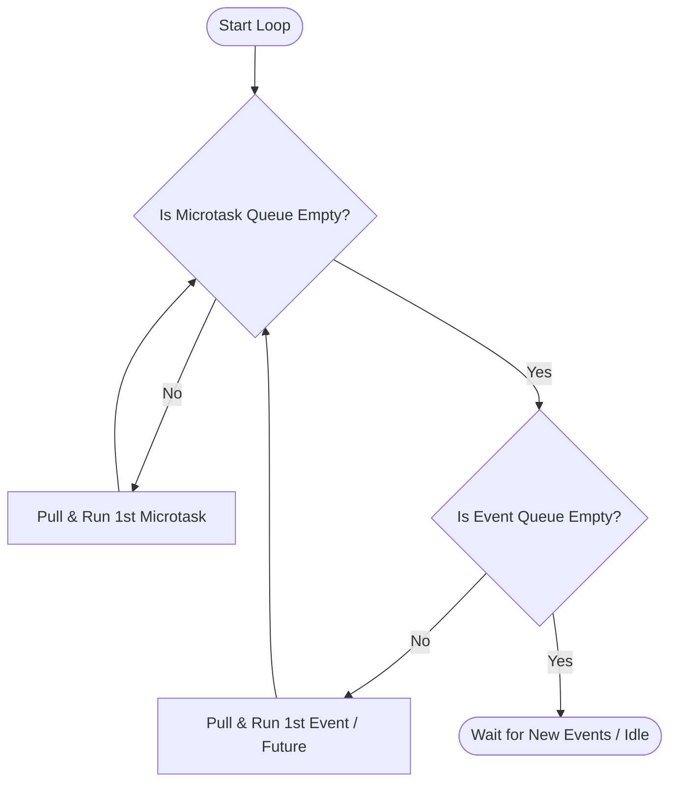

# Dart Event Loop & Task Scheduling Guide

A complete technical handbook on Dart's event scheduling mechanics, covering execution precedence, microtasks, event futures, and how to analyze complex scheduling problems during interviews.

---

## 1. Scheduling Precedence Rules

Dart executes asynchronous tasks using a strict **priority scheduling loop**:

1. **Synchronous Code**: Executed immediately on the active stack. Blocking synchronous operations halt the main execution thread completely.
2. **Microtasks (`scheduleMicrotask`)**: Executed once the synchronous call stack is completely empty. The runtime will process *all* outstanding microtasks sequentially before looking elsewhere.
3. **Events (Futures, Timers, I/O)**: Executed after the Microtask Queue is fully depleted.

---

## 2. Event Execution Flow

The following state machine details how the Dart runtime evaluates tasks across execution frames:



---

## 3. High-Yield Interview Challenge

Analyze the following Dart program and predict the exact console print sequence.

```dart
import 'dart:async';

void main() {
  print("1: Main Start");

  Timer.run(() => print("2: Event Queue - Timer.run"));

  scheduleMicrotask(() => print("3: Microtask Queue - step 1"));

  Future(() => print("4: Event Queue - Future"));

  Future.microtask(() => print("5: Microtask Queue - step 2"));

  Future.value("6: Synchronous Future Resolved").then((value) {
    print("7: Then callback for resolved Future: $value");
  });

  scheduleMicrotask(() {
    print("8: Microtask Queue - step 3");
    scheduleMicrotask(() => print("9: Nested Microtask"));
  });

  print("10: Main End");
}
```

### Exact Console Output Sequence
1. `1: Main Start`
2. `10: Main End`
3. `3: Microtask Queue - step 1`
4. `5: Microtask Queue - step 2`
5. `7: Then callback for resolved Future: 6: Synchronous Future Resolved`
6. `8: Microtask Queue - step 3`
7. `9: Nested Microtask`
8. `2: Event Queue - Timer.run`
9. `4: Event Queue - Future`

---

## 4. Under-the-Hood Breakdown

1. **Synchronous Execution**:
   * `1: Main Start` prints immediately.
   * `Timer.run()` registers a callback on the **Event Queue**.
   * `scheduleMicrotask()` registers `3: Microtask Queue - step 1` on the **Microtask Queue**.
   * `Future()` registers `4: Event Queue - Future` on the **Event Queue**.
   * `Future.microtask()` registers `5: Microtask Queue - step 2` on the **Microtask Queue**.
   * `Future.value().then()`: Because the Future is *already resolved* synchronously, Dart immediately queues the `then` callback `7: ...` as a **Microtask**.
   * `scheduleMicrotask()` registers `8: Microtask Queue - step 3` on the **Microtask Queue**.
   * `10: Main End` prints synchronously. The stack is now empty.
2. **Emptying the Microtask Queue**:
   * Run `3: Microtask Queue - step 1`.
   * Run `5: Microtask Queue - step 2`.
   * Run `7: Then callback...` (queued when the resolved Future's then block was read).
   * Run `8: Microtask Queue - step 3`. This prints the message and schedules a new microtask `9: Nested Microtask`.
   * **Rule Check**: The Microtask Queue is still not empty!
   * Run `9: Nested Microtask`. Now the Microtask Queue is completely empty.
3. **Processing the Event Queue**:
   * Pull and run `2: Event Queue - Timer.run` (it was registered first).
   * Pull and run `4: Event Queue - Future`.
   * Event loop enters idle state.
