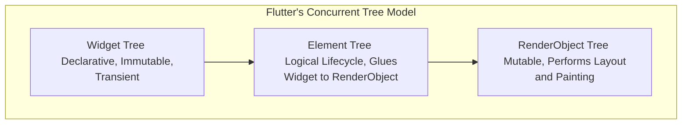

# Flutter Interview Patterns & Core Concepts

A high-yield guide to the architectural patterns, runtime rendering, and state management philosophies asked in senior Flutter/Dart engineering interviews.

---

## 1. The Three-Tree Architecture

Flutter does not compile down to native iOS or Android OEM platform widgets. Instead, it draws its UI directly onto an Skia or Impeller graphics canvas. To manage layout and state efficiently, Flutter implements three concurrent trees:

### 1. Widget Tree
* **Characteristics**: Immutable, lightweight, declarative configuration.
* **Role**: Describes what the UI should look like. Instantiated constantly during builds; extremely cheap to garbage collect.

### 2. Element Tree
* **Characteristics**: Mutable, persists across frames, represents the structural logical skeleton of the app.
* **Role**: Corresponds to a specific widget configuration. Manages state objects (`StatefulElement`) and links immutable widgets to their physical rendering nodes. 
* **Key Function**: When a widget is reconstructed, Flutter compares the new widget configuration's type and key with the existing element (`Widget.canUpdate(old, new)`). If they match, the element keeps its place and simply updates its reference to the new widget, avoiding rebuilding the heavy `RenderObject`.

### 3. RenderObject Tree
* **Characteristics**: Mutable, heavy, handles layout computations and drawing commands.
* **Role**: Measures sizes, sets constraints, positions elements (`performLayout()`), and paints pixels (`paint()`).

---

## 2. Widget Keys & Element Preservation

Keys are crucial for telling Flutter *which* widgets to preserve when they are reordered, deleted, or updated in state.

### Local Keys
1. **`ValueKey<T>`**: Preserves state based on a primitive value (e.g. `ValueKey(todo.id)`). Excellent for item lists.
2. **`ObjectKey`**: Preserves state based on the structural identity of a complex object.
3. **`UniqueKey`**: Forces the recreation of a widget and its element on every rebuild cycle. Used to reset state animations.

### Global Keys
* **`GlobalKey<T>`**: Grants global access to an Element's state from anywhere in the widget tree.
* **Relevance**: 
  * Allows a widget to change its parent *without* losing its state (element relocation).
  * Enables querying the exact boundary size/offset of a RenderObject on screen (`globalKey.currentContext?.findRenderObject()`).
  * **Warning**: GlobalKeys are highly resource-expensive. Overuse can cause memory leaks and major layout performance drops.

---

## 3. The Flutter Rendering Pipeline

To render frames at 60Hz/120Hz without stutter, Flutter executes a strict, pipeline-ordered cycle:

1. **User Input / Animate**: Processes touch actions, taps, and updates animation tickers.
2. **Build**: Reconstructs the declarative `Widget` tree.
3. **Layout**: Propagates **Constraints down** the RenderObject tree and receives **Sizes back up**. A parent tells a child its minimum/maximum size limits. The child computes its size and reports it back to the parent.
4. **Paint**: Generates structural drawing commands. RenderObjects create layers containing drawing actions.
5. **Rasterize (GPU)**: The Flutter Engine sends these drawing instructions to the GPU compositor (using Impeller or Skia) to draw individual pixels on screen.
