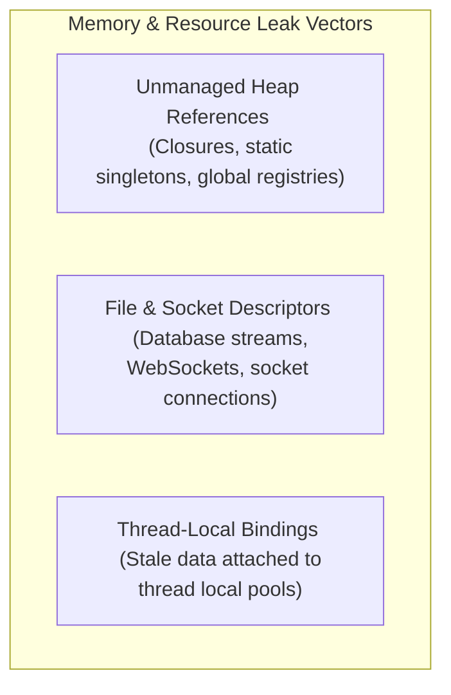

# Memory Management & Memory Leak Prevention

This guide covers identifying, diagnosing, and preventing memory and resource leaks across client-side runtimes (V8/Dart, Android JVM) and backend systems.

---

## 1. What is a Memory Leak?

A **Memory Leak** occurs when an allocated block of memory or system resource is no longer required by the application's runtime logic but remains reachable from "GC Roots" (active thread stacks, static variables, CPU execution registers). Because a reference pathway persists, the garbage collector cannot reclaim it, leading to heap inflation, system degradation, and eventual process crash (OOM).

---

## 2. Leak Vector Categories



### 1. Unmanaged Heap References & Closure Captures
* **Mechanism**: A closure (lambda or callback) implicitly retains a strong reference to the outer scope variables it references.
* **Client Systems**: Spawning an asynchronous thread or timer from a short-lived view controller using a lambda captures the entire controller context. If the view is closed, it remains pinned in memory.
* **Backend Systems**: Storing transactional state inside a static/global thread-safe registry map without removing key-value records upon transaction completion permanently leaks the state objects.

### 2. File & Socket Descriptors Leaks
* **Mechanism**: Operating systems limit the number of open file descriptors. Opening files, database pools, or socket connections without explicitly invoking `close()` leaks kernel-level resources.
* **Backend Systems**: If an API route opens a database connection from a connection pool and fails to return it in a `finally` block during exception triggers, the pool depletes, causing eventual API starvation.
* **Client Systems**: Unclosed Stream controllers, Animation controllers, or Broadcast receivers continue executing internal update loops, leaking memory.

### 3. ThreadLocal Reference Stale States
* **Mechanism**: ThreadLocal variables associate data with a specific thread execution context.
* **Backend Systems**: In Java Servlet engines (like Tomcat) that run thread pools, if a thread writes data to a ThreadLocal variable and the servlet returns without calling `threadLocal.remove()`, the data stays in heap pinned to that thread. When the thread is reused for subsequent user requests, it can lead to memory inflation and security data leaks between distinct requests.

---

## 3. Preventative Code Design

### 1. Strong vs. Weak References (WeakReference)
To break reference pathways where a parent holds a child, but the child needs a reference back without keeping the parent alive:

#### Kotlin (Using WeakReference)
```kotlin
import java.lang.ref.WeakReference

class TransactionLogger(context: TransactionContext) {
    // WeakReference allows context to be garbage collected when transaction finishes
    private val contextRef = WeakReference(context)

    fun logProgress(message: String) {
        val context = contextRef.get()
        if (context != null) {
            context.writeLog(message)
        }
    }
}
```

### 2. Auto-Closeable Resource Handling (Resource Pools)
Always enclose system resources in try-with-resources or automatic disposal blocks:

#### Kotlin (Using Use Block)
```kotlin
import java.io.File
import java.io.InputStream

fun readLogFile(path: String): String {
    // .use automatically invokes close() on completion, even if exceptions are thrown
    File(path).inputStream().use { stream ->
        return stream.readBytes().decodeToString()
      }
}
```

#### Dart (Stream Cleanup)
```dart
import 'dart:async';

class SessionController {
  final _controller = StreamController<String>();

  void dispose() {
    // Explicit close prevents stream controller from retaining memory
    _controller.close();
  }
}
```

---

## 4. Key Diagnostic Takeaways

* **Leak Detection Tools**:
  * **JVM/Backend**: Analyze heap dumps using Eclipse Memory Analyzer (MAT) or visual profiling tools (JProfiler, VisualVM) to look for memory-retaining paths.
  * **Client Applications**: Use LeakCanary for automated Android leaks, and Flutter DevTools Memory View for retaining path sweeps.
