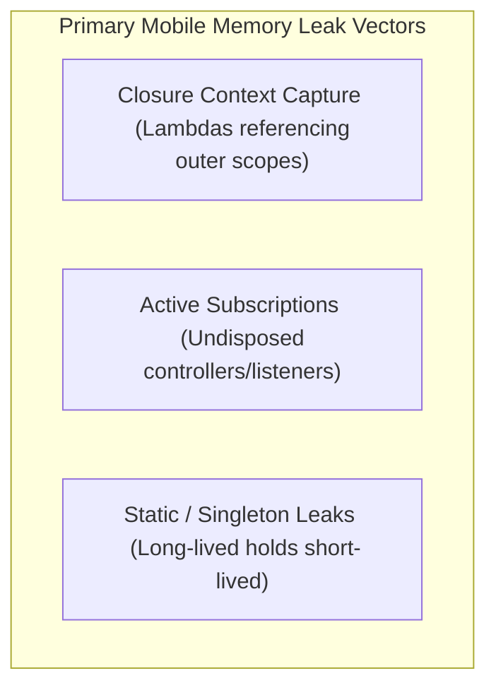

# Memory Management & Memory Leak Prevention

An engineering guide to identifying, resolving, and preventing memory leaks in Flutter/Dart and Android/Kotlin client applications.

---

## 1. What is a Memory Leak?

A **Memory Leak** occurs when an object is no longer needed or active in the application's runtime lifecycle, but it remains referenced by another active object. As a result, the Garbage Collector (GC) cannot reclaim its memory, leading to heap inflation and eventual Out-Of-Memory (OOM) crashes.

---

## 2. Common Leak Categories in Mobile Systems



### 1. Context Capturing in Closures (Lambdas)
* **Mechanism**: A closure (lambda or inline callback) implicitly retains a strong reference to the enclosing class instance if it references any of its member properties or functions.
* **Kotlin Example**: Spawning a background thread from an Activity using a lambda that calls a view method captures the entire `Activity` context. If the activity is destroyed (e.g. on screen rotation) before the thread completes, the entire activity is leaked.
* **Dart Example**: Passing a class instance method directly as a callback to a long-lived Singleton class keeps the short-lived widget or controller class alive in the singleton's callback list.

### 2. Undisposed Controllers & Event Listeners
* **Dart/Flutter**: Stream subscriptions (`StreamSubscription`), `AnimationController` tickers, `TextEditingController`, and `ChangeNotifier` listeners must be manually closed/disposed in the widget's lifecycle.
  * **Rule**: Always clean up resources inside `dispose()` of a `StatefulWidget`'s `State` class.
* **Kotlin/Android**: Undisposed RxJava `Disposable` objects, active coroutine jobs that are not cancelled, and unregistering broadcast receivers or event listeners in `onDestroy()` or `onStop()`.
  * **Solution**: Use `lifecycleScope`, `viewModelScope`, or explicit cancellation in lifecycle events.

### 3. Static/Singleton Reference Leaks
* **Mechanism**: Static variables and global Singletons live as long as the application process itself. Storing a reference to a short-lived component (like a View, Context, or Activity) inside a static property permanently leaks it.

---

## 3. Safe Coding Examples

### Dart / Flutter: Controller Cleanup
```dart
class CounterScreen extends StatefulWidget {
  @override
  _CounterScreenState createState() => _CounterScreenState();
}

class _CounterScreenState extends State<CounterScreen> {
  late final AnimationController _animationController;
  late final StreamSubscription _networkSubscription;

  @override
  void initState() {
    super.initState();
    // 1. Initialize resources
    _animationController = AnimationController(vsync: this, duration: Duration(seconds: 1));
    _networkSubscription = networkStatusStream.listen((status) {
      print("Status changed: $status");
    });
  }

  @override
  void dispose() {
    // 2. CRITICAL: Manual teardown to prevent memory leaks
    _animationController.dispose();
    _networkSubscription.cancel();
    super.dispose();
  }

  @override
  Widget build(BuildContext context) => Container();
}
```

### Kotlin: Avoiding Activity context leak using WeakReference
If a long-running background task must reference an `Activity` class but shouldn't keep it alive, wrap it in a `WeakReference`:

```kotlin
import java.lang.ref.WeakReference

class BackgroundWorker(activity: MainActivity) : Thread() {
    // WeakReference allows MainActivity to be garbage collected even while this thread is active
    private val activityRef = WeakReference(activity)

    override fun run() {
        sleep(5000) // Simulate network/DB query
        val activity = activityRef.get()
        if (activity != null && !activity.isFinishing) {
            activity.runOnUiThread {
                activity.updateUI("Operation complete")
            }
        }
    }
}
```

---

## 4. Key Takeaways for Senior Engineering Interviews

* **Strong vs. Weak References**: A Strong Reference prevents GC. A `WeakReference` (or `SoftReference`) allows the GC to reclaim the target object instantly during the next sweep if no strong references to it remain.
* **Leak Detection Tools**:
  * **Flutter**: Use the **DevTools Memory View**, perform heap snapshots, and search for objects retained by "retaining paths."
  * **Android**: Use **LeakCanary** (automatic background leak detection) and **Android Studio Profiler** heap dumps.
