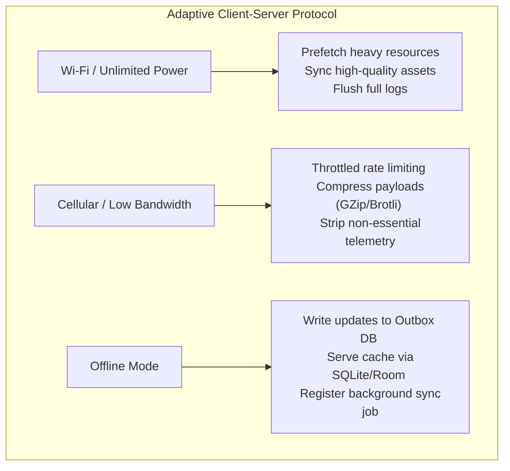
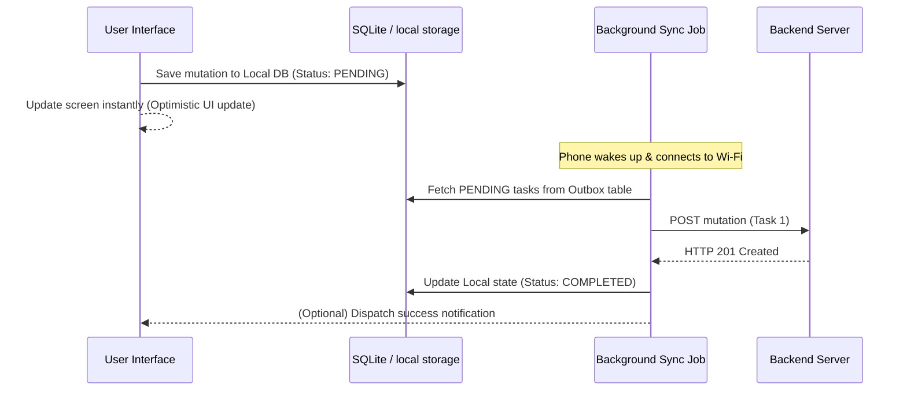

# Mobile System Design Foundations

A checklist and architectural blueprint for succeeding in mobile-specific system design interviews.

---

## 1. Core Constraints of Mobile Systems

Unlike backend system design where servers have high bandwidth and abundant power, mobile systems operate in resource-constrained environments:
1. **Network Volatility**: Edge networks, underground subways, and cellular dead zones cause rapid transitions between Offline, 2G, 5G, and Wi-Fi.
2. **Limited Battery & Thermal Limits**: Sustained CPU load or persistent radio active state drains battery and causes device throttling.
3. **RAM & Disk Limits**: Low-end phones have small heaps and limited physical flash memory. Memory leaks can crash the application.
4. **App Lifecycles**: The operating system can suspend or kill the application in the background at any moment to reclaim resources.

---

## 2. Adaptive Client-Server Communication

A robust mobile system adapts its network strategies based on connection state:

### 1. Payload Optimization
* **JSON vs. Protocol Buffers (protobuf)**: For heavy data systems (e.g. real-time stocks or chats), use Protobuf instead of JSON. Protobuf serializes into compact binary formats, reducing payload sizes by up to 70% and saving serialization CPU time on device.
* **HTTP/2 & HTTP/3**: Enables multiplexing multiple request streams over a single TCP/QUIC connection, reducing connection establishment overhead.

### 2. Synchronization Strategies
* **Pull-to-Refresh**: Manual REST endpoint query. Simple but leads to high API churn.
* **Long Polling / Server-Sent Events (SSE)**: Unidirectional stream from server to client. Excellent for read-heavy systems (e.g. live feeds).
* **WebSockets / gRPC Bidirectional Streams**: Persistent, low-overhead duplex connection. Crucial for real-time systems (e.g. Uber tracking, WhatsApp chat).

---

## 3. Offline-First Architecture & Outbox Pattern

To support offline editing (e.g. sending a message or liking a post while offline), modern mobile apps utilize the **Local Outbox Pattern**:

---

## 4. Key Interview Design Checklist

When asked to design a mobile feature (e.g., dynamic news feed, photo uploader), always address these topics:

| Design Area | Best-Practice Solutions |
|-------------|-------------------------|
| **Local Cache** | SQLite (Room/Wasm), Key-Value store (EncryptedSharedPreferences/Keychain), LRU Image cache. |
| **Data Fetching** | Cursor-based Pagination (protects RAM from large offsets), ETag HTTP headers (avoids re-downloading unchanged data). |
| **Image Loading** | Downsampling (resizing bitmap to match display constraints), WebP compression, lazy prefetching. |
| **Offline Sync** | Conflict-free Replicated Data Types (CRDTs) or Last-Write-Wins (LWW) timestamp tracking. |
| **Telemetry** | Batching logs locally, compressing arrays, uploading only over Wi-Fi + charging. |
| **Local Security** | SQLCipher database encryption, AES-GCM local file encryption, Biometrics API verification. |
