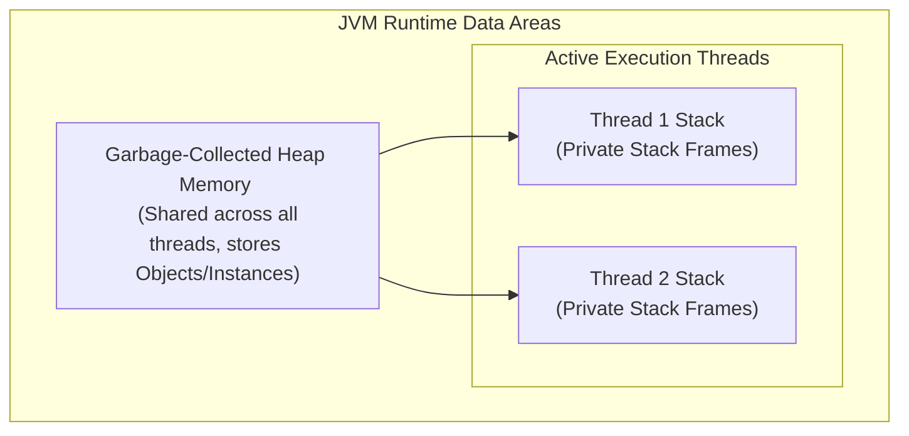
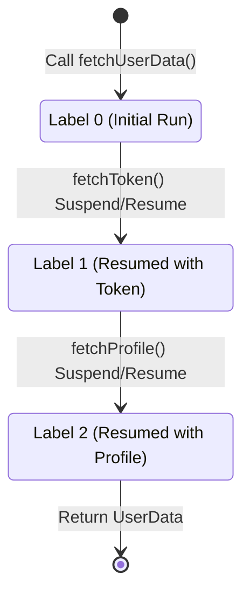

# Kotlin Runtime & Coroutine Mechanics

This document provides a highly detailed engineering guide to the Kotlin execution model on the JVM, focusing on how memory is structured, how thread synchronization operates, and the under-the-hood mechanics of Kotlin Coroutines.

---

## 1. JVM Memory Model: Heap vs. Stack

Kotlin/JVM is compiled into JVM Bytecode and runs on the Java Virtual Machine. Memory is split into two primary areas:



### Stack Memory
* **Ownership**: Every thread has its own private, isolated Stack.
* **Content**: Stores local variables, primitive data types, and references to objects on the Heap. Organized as **Stack Frames** (pushed on method invocation, popped on return).
* **Speed & Lifetime**: Extremely fast access, zero garbage collection overhead. Automatically reclaimed when a method finishes execution.

### Heap Memory
* **Ownership**: Shared across *all* active threads.
* **Content**: Stores all object instances (including arrays, class instances, Kotlin data classes, and closures/lambdas).
* **Garbage Collection**: Objects on the Heap are monitored by the JVM Garbage Collector. If an object is no longer reachable from any "GC Roots" (active thread stacks, static variables), it is swept and reclaimed.

---

## 2. Kotlin Coroutines Under the Hood: State Machines & Continuations

Kotlin Coroutines are often described as "lightweight threads," but they are actually a compiler-driven framework for cooperative multitasking. They do not map directly to OS threads. Instead, thousands of coroutines can share a single thread.

### The `suspend` Keyword & CPS Transformation
When the Kotlin compiler encounters a `suspend` function, it rewrites the function signature during compilation using a technique called **Continuation-Passing Style (CPS)**:

```kotlin
// Original Code
suspend fun fetchUserData(userId: String): UserData {
    val token = fetchToken()
    return fetchProfile(token, userId)
}

// Compiler Transformed Signature (Conceptual)
fun fetchUserData(userId: String, continuation: Continuation<Any?>): Any?
```

* **`Continuation` Interface**: Essentially a callback interface with a `resumeWith(result: Result<T>)` method.
* **Return Value**: The compiled function returns either the computed value (if execution was synchronous) or a special sentinel object: `COROUTINE_SUSPENDED`.

---

## 3. Suspend Functions as State Machines

To avoid allocating callback object layers for every step, the Kotlin compiler bundles the execution blocks of a suspending function into a single, highly optimized **State Machine class**:

```kotlin
// A conceptual representation of the compiled state machine for fetchUserData
class fetchUserData$continuation(val completion: Continuation<Any?>) : ContinuationImpl(...) {
    var result: Any? = null
    var label: Int = 0 // Tracks the current state of execution
    var token: String? = null // Saved local variables
    
    override fun invokeSuspend(result: Result<Any?>) {
        this.result = result
        return fetchUserData(null, this)
    }
}
```

### Execution Flow
1. **State 0 (Initial Invoke)**: `label = 0`. Calls `fetchToken(this)`. If `fetchToken` suspends, it returns `COROUTINE_SUSPENDED` and the thread is yielded.
2. **State 1 (Resume)**: Once token is ready, the scheduler resumes the continuation. `label` becomes `1`. The local variable `token` is retrieved from the continuation's internal state. It calls `fetchProfile(token, userId, this)`.
3. **State 2 (Finish)**: The profile returns, label becomes `2`, and the ultimate caller's `Continuation.resumeWith()` is triggered to deliver the result.



---

## 4. Structured Concurrency & Dispatchers

Kotlin enforces **Structured Concurrency**: all coroutines must be launched inside a designated `CoroutineScope`, which binds their lifecycles. If a parent coroutine is cancelled, all its child coroutines are automatically aborted, preventing orphan thread leaks.

### Coroutine Dispatchers
Dispatchers specify which OS thread pools the coroutines run on:
1. **`Dispatchers.Main`**: Bound to the mobile platform's UI/Main Thread. Used for UI changes, layout triggers, and rendering updates.
2. **`Dispatchers.IO`**: Optimized for blocking I/O tasks (network requests, database operations, file read/writes). Shares threads in a dynamic, highly scale-elastic pool.
3. **`Dispatchers.Default`**: Optimized for CPU-intensive background computations (heavy sorting, image manipulation, cryptographic math). Bound to the number of CPU cores.

---

## 5. JVM Concurrency & Thread Safety

When running parallel execution blocks on multi-threaded runtimes, memory visibility and race conditions must be addressed using:
* **Volatiles (`@Volatile`)**: Ensures that writes to a field are instantly visible to all other threads, bypassing CPU cache levels. It does *not* offer lock-safe operation; it only solves visibility issues.
* **Synchronized Blocks (`@Synchronized` / `synchronized(lock)`)**: Guarantees that only a single thread can execute a code block at a time. However, this blocks the underlying OS thread, which is discouraged inside Coroutine scopes.
* **Mutex (`kotlinx.coroutines.sync.Mutex`)**: The non-blocking Coroutine equivalent of `synchronized`. It suspends the coroutine instead of blocking the physical OS thread, protecting performance.
* **Atomic Primitives (`AtomicInteger`, `AtomicReference`)**: Uses low-level hardware CPU Compare-And-Swap (CAS) instructions to perform thread-safe increments and mutations with zero lock overhead.
