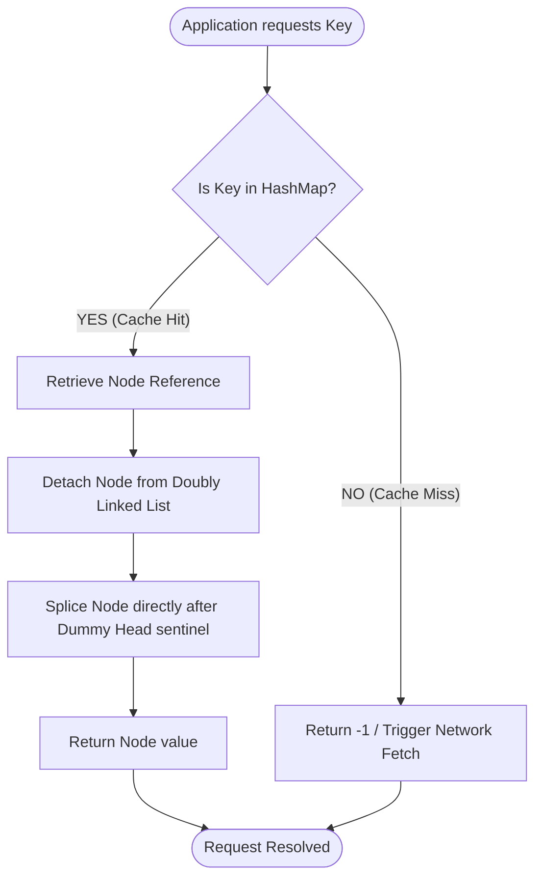
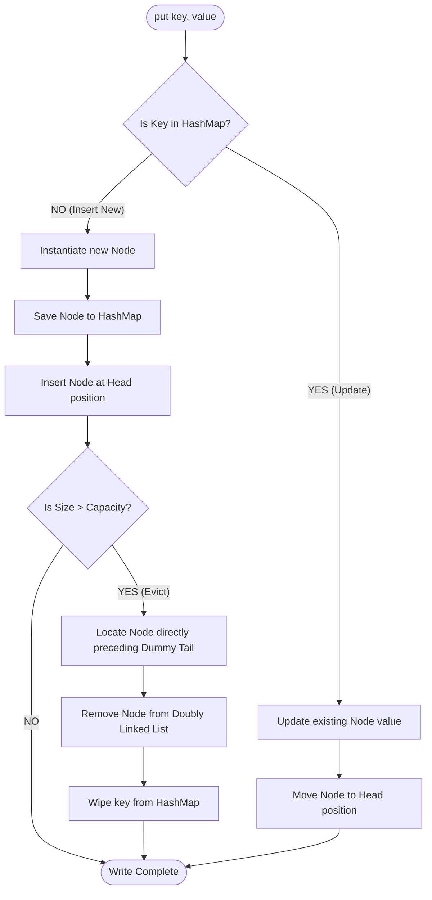
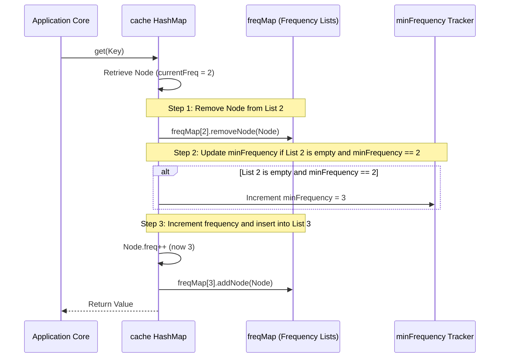

# Cache Eviction Flow & Mechanics

This document provides visual flowcharts mapping out cache queries, hit transitions, and eviction processing inside Least Recently Used (LRU) and Least Frequently Used (LFU) mobile caching engines.

---

## 1. LRU Cache hit / Miss Flowchart

When an application queries the cache for a specific key (e.g. fetching a cached image bitmap), the LRU Cache performs the following checks:

---

## 2. LRU Cache Insertion and Eviction Mechanics

When writing new data (e.g. saving an API response payload), the cache evaluates memory limits:

---

## 3. LFU Cache Dual-Map Dynamic Bucket Shifts

Unlike LRU which only tracks recency, LFU organizes keys into **frequency buckets**. Accessing a key moves it across lists:

