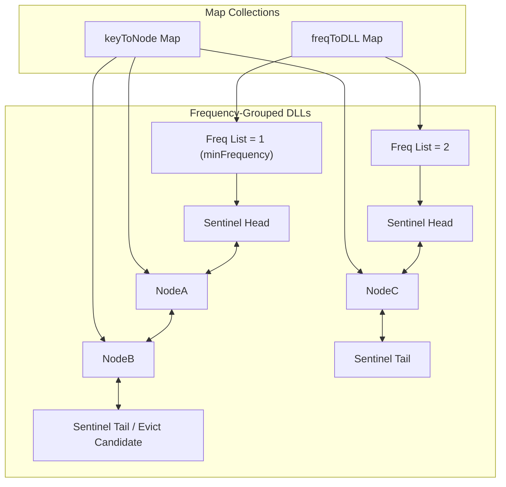

# Least Frequently Used (LFU) Cache

## Pattern
**Dual Hash Maps + Frequency-Grouped Doubly Linked Lists** (for $O(1)$ updates and evictions based on access frequency).

---

## Problem
Design and implement an LFU (Least Frequently Used) cache with $O(1)$ time complexity for its operations.
Implement the `LFUCache` class:
* `LFUCache(int capacity)`: Initializes the cache with its positive capacity limit.
* `int get(key)`: Gets the value of the `key` if it exists in the cache, otherwise returns `-1`.
* `void put(key, value)`: Updates the value of the `key` if present, or inserts the key if not already present. When the cache reaches its capacity, it must invalidate the least frequently used key before inserting a new item. If there is a tie (multiple keys have the same minimum frequency), the least recently used key among them is evicted.

---

## Approach
To achieve $O(1)$ performance, we can group nodes of the *same* frequency into their own individual Doubly Linked Lists (DLL), where each list functions like an independent LRU cache.

We maintain:
1. **`keyToNode` Map**: Maps keys to their node references.
2. **`freqToDLL` Map**: Maps an integer frequency (e.g. `1`, `2`, `3`) to a DLL of nodes that have been accessed exactly that many times. Nodes are added to the head of a DLL on update, meaning the tail of any frequency DLL is the Least Recently Used (LRU) node for that frequency.
3. **`minFrequency` Variable**: Tracks the lowest frequency current in the cache. This tells us instantly which DLL to look at when evicting.



---

## Time Complexity
* **`get(key)`**: **$O(1)$** - Map lookup is $O(1)$, frequency increment and list transition is $O(1)$.
* **`put(key, value)`**: **$O(1)$** - Constant-time insertions, frequency promotions, and tail node evictions.

## Space Complexity
**$O(C)$**: Where $C$ is the cache capacity. The maps and DLLs store at most $C$ items.

---

## Why This Solution Works
Using a simple priority queue (min-heap) to track frequencies would result in $O(\log C)$ time complexity for insertions and updates. By grouping nodes with identical frequencies together in doubly linked lists and mapping those lists directly, we can move a node from one frequency list to the next in constant time, achieving true $O(1)$ complexity.

---

## Mobile Engineering Relevance
While LRU caches are suitable for temporary scroll buffers (like image feeds), LFU caches are ideal for long-lived application session data.
* **Persistent Cache Management**: In a mobile application, resources like user profile details, system settings, localized translation catalogs, or offline database schemas are accessed repeatedly across hours or days of runtime.
* **Intelligent Eviction**: If space becomes low, we should evict items that are rarely or never requested, rather than recently requested items. LFU ensures high-utility settings (accessed 100 times) are preserved in RAM, while a user profile viewed only once is discarded, minimizing network requests and battery drain.

---

## Tradeoffs
* **Complexity vs. Memory**: LFU caches require multiple sentinel doubly linked lists and complex pointer updates, making them harder to debug. They also consume slightly more memory than standard LRU caches. For memory-starved watch apps or widgets, simple LRU is preferred, but for feature-rich client apps, LFU yields superior cache hit rates for persistent resources.

---

## Code Solution

### Dart
```dart
class LFUNode {
  int key;
  int value;
  int freq;
  LFUNode? prev;
  LFUNode? next;

  LFUNode(this.key, this.value, {this.freq = 1});
}

class DoubleLinkedList {
  final LFUNode head = LFUNode(0, 0);
  final LFUNode tail = LFUNode(0, 0);
  int size = 0;

  DoubleLinkedList() {
    head.next = tail;
    tail.prev = head;
  }

  void addToHead(LFUNode node) {
    node.next = head.next;
    node.next?.prev = node;
    head.next = node;
    node.prev = head;
    size++;
  }

  void remove(LFUNode node) {
    node.prev?.next = node.next;
    node.next?.prev = node.prev;
    size--;
  }

  LFUNode removeTail() {
    LFUNode lru = tail.prev!;
    remove(lru);
    return lru;
  }
}

class LFUCache {
  final int capacity;
  final Map<int, LFUNode> _keyToNode = {};
  final Map<int, DoubleLinkedList> _freqToDLL = {};
  int minFrequency = 0;

  LFUCache(this.capacity);

  int get(int key) {
    LFUNode? node = _keyToNode[key];
    if (node == null) return -1;

    _updateFrequency(node);
    return node.value;
  }

  void put(int key, int value) {
    if (capacity <= 0) return;

    LFUNode? node = _keyToNode[key];
    if (node != null) {
      node.value = value;
      _updateFrequency(node);
    } else {
      if (_keyToNode.length >= capacity) {
        DoubleLinkedList minFreqList = _freqToDLL[minFrequency]!;
        LFUNode evicted = minFreqList.removeTail();
        _keyToNode.remove(evicted.key);
      }

      LFUNode newNode = LFUNode(key, value, freq: 1);
      _keyToNode[key] = newNode;
      minFrequency = 1;
      
      _freqToDLL.putIfAbsent(1, () => DoubleLinkedList()).addToHead(newNode);
    }
  }

  void _updateFrequency(LFUNode node) {
    int oldFreq = node.freq;
    DoubleLinkedList oldList = _freqToDLL[oldFreq]!;
    oldList.remove(node);

    if (oldFreq == minFrequency && oldList.size == 0) {
      minFrequency++;
    }

    node.freq++;
    _freqToDLL.putIfAbsent(node.freq, () => DoubleLinkedList()).addToHead(node);
  }
}

void main() {
  final cache = LFUCache(2);
  cache.put(1, 10);
  cache.put(2, 20);
  print(cache.get(1));    // returns 10 (freq of 1 becomes 2)
  cache.put(3, 30);       // evicts key 2 (freq 1 is less than key 1's freq 2)
  print(cache.get(2));    // returns -1 (evicted)
  print(cache.get(3));    // returns 30 (freq of 3 becomes 2)
  cache.put(4, 40);       // evicts key 1 (both 1 and 3 are freq 2, but 1 is LRU)
  print(cache.get(1));    // returns -1 (evicted)
  print(cache.get(3));    // returns 30
  print(cache.get(4));    // returns 40
}
```

### Kotlin
```kotlin
class LFUCache(private val capacity: Int) {
    private class LFUNode(val key: Int, var value: Int, var freq: Int = 1) {
        var prev: LFUNode? = null
        var next: LFUNode? = null
    }

    private class DoubleLinkedList {
        val head = LFUNode(0, 0)
        val tail = LFUNode(0, 0)
        var size = 0
            private set

        init {
            head.next = tail
            tail.prev = head
        }

        fun addToHead(node: LFUNode) {
            node.next = head.next
            node.next?.prev = node
            head.next = node
            node.prev = head
            size++
        }

        fun remove(node: LFUNode) {
            node.prev?.next = node.next
            node.next?.prev = node.prev
            size--
        }

        fun removeTail(): LFUNode {
            val lru = tail.prev!!
            remove(lru)
            return lru
        }
    }

    private val keyToNode = HashMap<Int, LFUNode>()
    private val freqToDLL = HashMap<Int, DoubleLinkedList>()
    private var minFrequency = 0

    fun get(key: Int): Int {
        val node = keyToNode[key] ?: return -1
        updateFrequency(node)
        return node.value
    }

    fun put(key: Int, value: Int) {
        if (capacity <= 0) return

        val node = keyToNode[key]
        if (node != null) {
            node.value = value
            updateFrequency(node)
        } else {
            if (keyToNode.size >= capacity) {
                val minFreqList = freqToDLL[minFrequency]!!
                val evicted = minFreqList.removeTail()
                keyToNode.remove(evicted.key)
            }

            val newNode = LFUNode(key, value, 1)
            keyToNode[key] = newNode
            minFrequency = 1
            freqToDLL.computeIfAbsent(1) { DoubleLinkedList() }.addToHead(newNode)
        }
    }

    private fun updateFrequency(node: LFUNode) {
        val oldFreq = node.freq
        val oldList = freqToDLL[oldFreq]!!
        oldList.remove(node)

        if (oldFreq == minFrequency && oldList.size == 0) {
            minFrequency++
        }

        node.freq++
        freqToDLL.computeIfAbsent(node.freq) { DoubleLinkedList() }.addToHead(node)
    }
}

fun main() {
    val cache = LFUCache(2)
    cache.put(1, 10)
    cache.put(2, 20)
    println(cache.get(1)) // returns 10 (freq of 1 becomes 2)
    cache.put(3, 30)      // evicts key 2 (freq 1 is less than key 1's freq 2)
    println(cache.get(2)) // returns -1 (evicted)
    println(cache.get(3)) // returns 30 (freq of 3 becomes 2)
    cache.put(4, 40)      // evicts key 1 (both 1 and 3 are freq 2, but 1 is LRU)
    println(cache.get(1)) // returns -1 (evicted)
    println(cache.get(3)) // returns 30
    println(cache.get(4)) // returns 40
}
```
