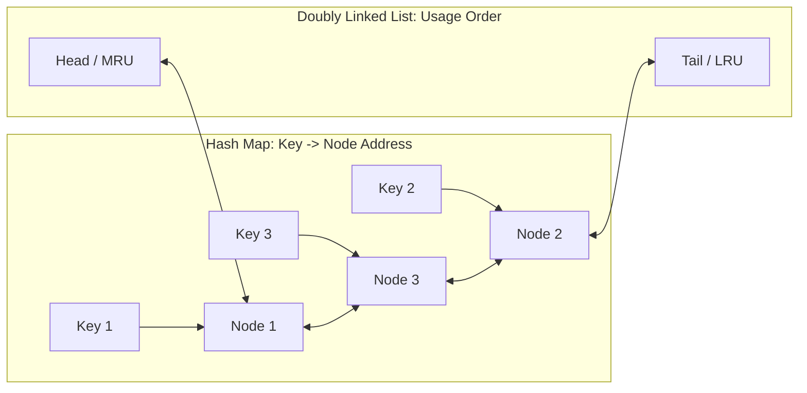

# Least Recently Used (LRU) Cache

## Pattern
**Doubly Linked List + Hash Map** (for $O(1)$ updates and lookups).

---

## Problem
Design a data structure that follows the constraints of a **Least Recently Used (LRU) Cache**.
Implement the `LRUCache` class:
* `LRUCache(int capacity)`: Initialize the cache with positive size capacity.
* `int get(key)`: Return the value of the `key` if it exists, otherwise return `-1`.
* `void put(key, value)`: Update the value of the `key` if it exists. Otherwise, add the `key-value` pair to the cache. If the number of keys exceeds the capacity from this operation, evict the least recently used key.

---

## Approach
To guarantee $O(1)$ time complexity for both `get` and `put`, we pair a **Hash Map** with a **Doubly Linked List**:
1. **Doubly Linked List (DLL)**: Represents chronological usage. 
   * **Head**: Most Recently Used (MRU) element.
   * **Tail**: Least Recently Used (LRU) element.
2. **Hash Map**: Maps keys to the memory address of the nodes in our DLL. This yields $O(1)$ lookup times.
3. **`get(key)`**: Look up the node in the map. If it exists, move the node to the head of the DLL (it was just used) and return its value.
4. **`put(key, value)`**: If the key exists, update its value and move it to the head. If it does not exist:
   * Create a new node.
   * If capacity is reached, remove the tail node of the DLL and delete its entry from the map.
   * Insert the new node at the head of the DLL and register it in the map.



---

## Time Complexity
* **`get(key)`**: **$O(1)$** - Map lookup is $O(1)$, and shifting a doubly-linked node to the head is $O(1)$.
* **`put(key, value)`**: **$O(1)$** - Node insertion at the head and eviction at the tail are both $O(1)$ pointer operations.

## Space Complexity
**$O(C)$**: Where $C$ is the cache capacity. The hash map and the doubly linked list store at most $C$ items.

---

## Why This Solution Works
Using a simple list would require $O(C)$ to search and delete nodes during reordering. A singly linked list would require $O(C)$ to locate the parent of a node being removed. A doubly-linked list stores direct pointers to `prev` and `next`, enabling $O(1)$ removals, insertions, and reorderings from any arbitrary point in the list.

---

## Mobile Engineering Relevance
LRU caching is the lifeblood of mobile resource management, serving as the foundation of image loaders, HTTP caches, and local persistence layer buffers.
* **Image Caching (Coil / Glide / Flutter cached_network_image)**: Bitmaps (images) are highly resource-intensive. If a mobile app scrolls through a long feed of images, keeping all downloaded bitmaps in RAM will trigger an Out Of Memory (OOM) crash.
* **Memory Pruning**: An LRU Cache allows setting a maximum memory limit (e.g. 20% of device RAM). When new images are scrolled into view and exceed this capacity, the least-recently-viewed bitmaps are safely evicted and garbage collected.
* **Session Cache / DB Buffer**: Network requests are expensive and drain battery. Caching API responses in an LRU database buffer speeds up screen transitions and facilitates offline-first usability.

---

## Tradeoffs
* **Memory Overhead**: Maintaining pointers for `prev` and `next` in DLL nodes, combined with the HashMap buckets, creates minor object allocation overhead compared to raw arrays. For small memory constraints, a linear array might be preferred, but for production systems, the constant time lookup and update complexity of DLL + Map is indispensable.

---

## Code Solution

### Dart
```dart
class DoubleNode {
  int key;
  int value;
  DoubleNode? prev;
  DoubleNode? next;

  DoubleNode(this.key, this.value);
}

class LRUCache {
  final int capacity;
  final Map<int, DoubleNode> _map = {};
  
  // Sentinel head & tail nodes to avoid null checking in DLL operations
  late final DoubleNode _head;
  late final DoubleNode _tail;

  LRUCache(this.capacity) {
    _head = DoubleNode(0, 0);
    _tail = DoubleNode(0, 0);
    _head.next = _tail;
    _tail.prev = _head;
  }

  int get(int key) {
    DoubleNode? node = _map[key];
    if (node == null) return -1;

    // Move to head (most recently used)
    _remove(node);
    _addToHead(node);

    return node.value;
  }

  void put(int key, int value) {
    DoubleNode? node = _map[key];
    if (node != null) {
      // Update value and move to head
      node.value = value;
      _remove(node);
      _addToHead(node);
    } else {
      if (_map.length >= capacity) {
        // Evict LRU (tail's prev)
        DoubleNode lru = _tail.prev!;
        _remove(lru);
        _map.remove(lru.key);
      }
      
      DoubleNode newNode = DoubleNode(key, value);
      _addToHead(newNode);
      _map[key] = newNode;
    }
  }

  // Helper DLL operations
  void _remove(DoubleNode node) {
    node.prev?.next = node.next;
    node.next?.prev = node.prev;
  }

  void _addToHead(DoubleNode node) {
    node.next = _head.next;
    node.next?.prev = node;
    _head.next = node;
    node.prev = _head;
  }
}

void main() {
  final cache = LRUCache(2);
  cache.put(1, 10);
  cache.put(2, 20);
  print(cache.get(1));    // returns 10
  cache.put(3, 30);       // evicts key 2
  print(cache.get(2));    // returns -1 (evicted)
  cache.put(4, 40);       // evicts key 1
  print(cache.get(1));    // returns -1 (evicted)
  print(cache.get(3));    // returns 30
  print(cache.get(4));    // returns 40
}
```

### Kotlin
```kotlin
class LRUCache(private val capacity: Int) {
    private class DoubleNode(val key: Int, var value: Int) {
        var prev: DoubleNode? = null
        var next: DoubleNode? = null
    }

    private val map = HashMap<Int, DoubleNode>()
    private val head = DoubleNode(0, 0)
    private val tail = DoubleNode(0, 0)

    init {
        head.next = tail
        tail.prev = head
    }

    fun get(key: Int): Int {
        val node = map[key] ?: return -1
        remove(node)
        addToHead(node)
        return node.value
    }

    fun put(key: Int, value: Int) {
        val node = map[key]
        if (node != null) {
            node.value = value
            remove(node)
            addToHead(node)
        } else {
            if (map.size >= capacity) {
                val lru = tail.prev!!
                remove(lru)
                map.remove(lru.key)
            }
            val newNode = DoubleNode(key, value)
            addToHead(newNode)
            map[key] = newNode
        }
    }

    private fun remove(node: DoubleNode) {
        node.prev?.next = node.next
        node.next?.prev = node.prev
    }

    private fun addToHead(node: DoubleNode) {
        node.next = head.next
        node.next?.prev = node
        head.next = node
        node.prev = head
    }
}

fun main() {
    val cache = LRUCache(2)
    cache.put(1, 10)
    cache.put(2, 20)
    println(cache.get(1)) // returns 10
    cache.put(3, 30)      // evicts key 2
    println(cache.get(2)) // returns -1 (evicted)
    cache.put(4, 40)      // evicts key 1
    println(cache.get(1)) // returns -1 (evicted)
    println(cache.get(3)) // returns 30
    println(cache.get(4)) // returns 40
}
```
