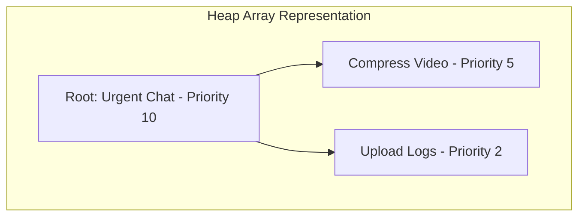

# Priority-based Task Scheduler

## Pattern
**Heaps / Priority Queue** (for $O(\log N)$ task scheduling based on priority/time).

---

## Problem
Design a **Task Scheduler** that accepts background tasks, each with a designated **priority level** (e.g., HIGH, MEDIUM, LOW) or a designated **execution time** (e.g., in milliseconds for retry delays). The scheduler must always execute the task with the highest priority first. If priorities are equal, tasks should be executed in First-In-First-Out (FIFO) order.

---

## Approach
To guarantee optimal $O(\log N)$ inserts and removals, we use a **Min-Heap / Max-Heap** (represented as a Priority Queue):
1. **Task Model**: A `Task` class has a `priority` (integer rating, where higher numbers represent higher priority) and a `sequenceNumber` (to maintain FIFO order on ties).
2. **Min/Max-Heap**: We maintain a Heap array representation:
   * **Insert (Enqueue)**: Add the task to the end of the array, then perform a "bubble-up" operation to restore the heap invariant. Time: $O(\log N)$.
   * **Extract (Dequeue)**: Remove the root task (highest priority), swap the last element to the root, then perform a "bubble-down" operation. Time: $O(\log N)$.
3. **Execution Engine**: An event loop or background thread pool repeatedly extracts the top task from the heap and processes it.



---

## Time Complexity
* **`schedule(task)`**: **$O(\log N)$** - Bubbling a task up a heap of size $N$ takes logarithmic time.
* **`getNextTask()`**: **$O(\log N)$** - Bubbling the replacement element down the heap takes logarithmic time.
* **`peek()`**: **$O(1)$** - Accessing the root element takes constant time.

## Space Complexity
**$O(N)$**: To store $N$ tasks in the heap array.

---

## Why This Solution Works
A simple sorted list or array would take $O(N)$ time to insert tasks in sorted order. An unsorted list would take $O(N)$ time to search for the highest-priority task on every extraction. A binary heap structure perfectly balances insertion and deletion times at $O(\log N)$, which is optimal for dynamic, highly volatile task lists.

---

## Mobile Engineering Relevance
Mobile platforms must constantly balance network requests, battery usage, and UI responsiveness. 
* **Prioritized Background Workers**: Imagine an offline outbox in a chat app.
  * **Priority 10 (Urgent)**: Direct user chat messages.
  * **Priority 5 (Medium)**: Profile picture update.
  * **Priority 2 (Low)**: Telemetry and user behavior analytics.
* **WorkManager / JobScheduler**: Android's `WorkManager` and iOS's `BackgroundTasks` framework prioritize network requests and deferred sync jobs using priority queues to execute high-value user operations first.
* **Network Retry Jitter**: When a request fails, a scheduler queues a retry task with exponential backoff + jitter. The execution time acts as the priority metric.

---

## Tradeoffs
* **Custom Heap vs. Sorted Array**: For extremely small queue sizes ($N < 10$), a simple sorted array with linear search might perform faster due to cache locality and zero pointer overhead. However, as background jobs scale, a binary heap is essential to maintain predictable, lightweight operation without choking the runtime.

---

## Code Solution

### Dart
Since Dart does not include a built-in `PriorityQueue` in its core library, we implement a custom binary max-heap.

```dart
class Task implements Comparable<Task> {
  final String id;
  final String description;
  final int priority; // Higher number = Higher priority
  final int sequenceNumber;

  Task(this.id, this.description, this.priority, this.sequenceNumber);

  @override
  int compareTo(Task other) {
    if (priority != other.priority) {
      return other.priority.compareTo(priority); // Max-heap behavior
    }
    return sequenceNumber.compareTo(other.sequenceNumber); // FIFO on tie
  }

  @override
  String toString() => 'Task(id: $id, priority: $priority, seq: $sequenceNumber)';
}

class PriorityTaskScheduler {
  final List<Task> _heap = [];
  int _sequenceCounter = 0;

  void schedule(String id, String description, int priority) {
    final task = Task(id, description, priority, _sequenceCounter++);
    _heap.add(task);
    _bubbleUp(_heap.length - 1);
  }

  Task? getNextTask() {
    if (_heap.isEmpty) return null;
    final top = _heap[0];
    final last = _heap.removeLast();
    if (_heap.isNotEmpty) {
      _heap[0] = last;
      _bubbleDown(0);
    }
    return top;
  }

  void _bubbleUp(int index) {
    while (index > 0) {
      int parent = (index - 1) ~/ 2;
      if (_heap[index].compareTo(_heap[parent]) >= 0) break;
      _swap(index, parent);
      index = parent;
    }
  }

  void _bubbleDown(int index) {
    int size = _heap.length;
    while (2 * index + 1 < size) {
      int leftChild = 2 * index + 1;
      int rightChild = 2 * index + 2;
      int smallest = leftChild;

      if (rightChild < size && _heap[rightChild].compareTo(_heap[leftChild]) < 0) {
        smallest = rightChild;
      }
      if (_heap[index].compareTo(_heap[smallest]) <= 0) break;
      _swap(index, smallest);
      index = smallest;
    }
  }

  void _swap(int i, int j) {
    final temp = _heap[i];
    _heap[i] = _heap[j];
    _heap[j] = temp;
  }

  bool get isEmpty => _heap.isEmpty;
}

void main() {
  print("=== Dart Custom Heap Task Scheduler ===");
  final scheduler = PriorityTaskScheduler();

  scheduler.schedule("1", "Sync telemetry logs", 2);
  scheduler.schedule("2", "Send urgent chat message", 10);
  scheduler.schedule("3", "Sync database offline storage", 5);
  scheduler.schedule("4", "Send another chat message", 10); // FIFO tie test

  while (!scheduler.isEmpty) {
    print("Executing: ${scheduler.getNextTask()}");
  }
}
```

### Kotlin
In Kotlin, we can leverage JVM's thread-safe concurrent wrappers and standard library `PriorityQueue`.

```kotlin
import java.util.PriorityQueue
import java.util.concurrent.atomic.AtomicInteger

class Task(
    val id: String,
    val description: String,
    val priority: Int, // Higher number = Higher priority
    val sequenceNumber: Int
) : Comparable<Task> {

    override fun compareTo(other: Task): Int {
        if (this.priority != other.priority) {
            return other.priority.compareTo(this.priority) // Max-Heap behavior
        }
        return this.sequenceNumber.compareTo(other.sequenceNumber) // FIFO on tie
    }

    override fun toString(): String {
        return "Task(id='$id', priority=$priority, seq=$sequenceNumber, desc='$description')"
    }
}

class PriorityTaskScheduler {
    private val heap = PriorityQueue<Task>()
    private val sequenceCounter = AtomicInteger(0)

    @Synchronized
    fun schedule(id: String, description: String, priority: Int) {
        val task = Task(id, description, priority, sequenceCounter.getAndIncrement())
        heap.add(task)
    }

    @Synchronized
    fun getNextTask(): Task? {
        return heap.poll()
    }

    val isEmpty: Boolean
        @Synchronized get() = heap.isEmpty()
}

fun main() {
    println("=== Kotlin Priority Task Scheduler ===")
    val scheduler = PriorityTaskScheduler()

    scheduler.schedule("1", "Upload analytics logs", 2)
    scheduler.schedule("2", "Send urgent text message", 10)
    scheduler.schedule("3", "Prefetch user details", 5)
    scheduler.schedule("4", "Send immediate group text", 10) // FIFO test

    while (!scheduler.isEmpty) {
        println("Executing: ${scheduler.getNextTask()}")
    }
}
```
