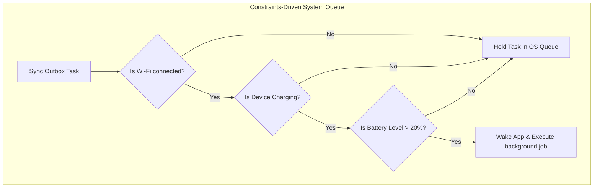

# WorkManager & Background Sync System Design

## 1. The Mobile Background Execution Challenge
Mobile operating systems (iOS and Android) enforce aggressive power-management rules to prevent background apps from draining battery, hogging CPU, and exhausting system RAM:
* **Background Termination**: If an app runs a infinite loop in the background, the OS will silently terminate the process.
* **Network Throttling**: Background HTTP requests are delayed, throttled, or flat-out blocked depending on battery saver states.

To execute deferred, persistent tasks (like syncing databases, flushing telemetry, or fetching feed details offline), mobile applications must delegate execution to system background schedulers (**Jetpack WorkManager** on Android, **BackgroundTasks framework** on iOS).

---

## 2. Constraints-Driven Scheduling

Instead of running immediately, background sync tasks specify execution **Constraints**. The operating system holds the tasks in an internal SQLite queue and only wakes the application to run the task *when all constraints are satisfied*:

### Core Constraints
1. **NetworkState**:
   * `CONNECTED`: Any active cellular or Wi-Fi network.
   * `UNMETERED`: High-bandwidth, free network (e.g. Wi-Fi). Highly recommended for heavy uploads/downloads to save user cellular plans.
2. **RequiresCharging**: Task only executes while the device is plugged in, bypassing thermal/battery limits.
3. **RequiresDeviceIdle**: Runs only when the user is not actively interacting with the device, protecting responsiveness.
4. **RequiresBatteryNotLow**: Prevents execution if battery saving modes are active.

---

## 3. Backoff Policy & Retries

Background tasks frequently fail due to server downtime or transient network drops. Schedulers handle this via an automatic **Backoff Policy**:

* **Linear Backoff**: Retries occur at a steady, incrementing interval (e.g., 10 minutes, 20 minutes, 30 minutes).
* **Exponential Backoff**: Multiplies the retry interval by a power of two on consecutive failures (e.g., 30 seconds, 1 minute, 2 minutes, 4 minutes). This protects backend APIs from self-inflicted DDoS drops.
