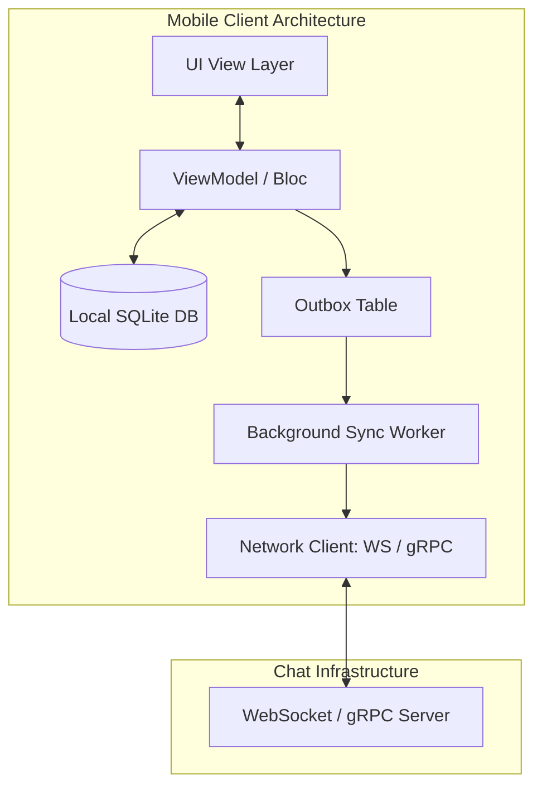

# Mobile System Design: Real-Time Chat Client Architecture

This document outlines the client-side system design for a scalable, highly robust, offline-first Real-Time Chat application.

---

## 1. High-Level Architecture Overview

A production-grade mobile chat client operates using three core layers:
1. **Network Sync Layer**: Establishes WebSockets or gRPC streams for real-time message exchange and fallback REST polling.
2. **Local Persistence Layer**: A local SQLite database (using Room for Android/Kotlin or Drift for Flutter/Dart) acting as the single source of truth (SSOT).
3. **UI / Presentation Layer**: A state-driven UI that renders messages directly from a local database stream (e.g. reactive Flow or Stream queries).

---

## 2. Network Protocols: WebSockets vs. gRPC

For duplex communication, modern chat architectures choose between WebSockets and gRPC:

### 1. WebSockets
* **Pros**: Standard, highly supported, lightweight frame wrapper over TCP. High browser and client library compatibility.
* **Cons**: No native typing (sends raw text/JSON frames). Heartbeat mechanism (ping/pong) must be custom-built to keep connection alive and detect connection drops.

### 2. gRPC Bidirectional Streaming
* **Pros**: Native typing via Protocol Buffers. Extremely small binary footprint in transit, reducing network usage. Built-in HTTP/2 multiplexing and flow control. Native support for retry strategies.
* **Cons**: Requires gRPC-compatible proxies/gateways on the backend. Higher setup complexity.

---

## 3. Data Synchronization & Conflict Resolution

When a mobile app connects after being offline, it must reconcile messages.

### Message Sync Strategy (Cursor-based)
1. **Local State**: The database tracks the largest `message_timestamp` or `sequence_id` it has locally.
2. **Dynamic Sync Check**: On socket reconnect, the client issues a `GET /messages?after_id={latest_local_id}` REST/gRPC query.
3. **Database Injection**: The server returns the missed message stream. The client injects them into the local DB in a single SQL transaction. Because the UI observes the DB, the chat screen automatically renders the new messages seamlessly.

---

## 4. The Local Outbox Pattern (Offline Queue)

To allow users to type and send messages while offline:

1. **State Mutation**: When the user clicks "Send," the message is instantly written to the local database with `send_status = PENDING`.
2. **Optimistic UI Update**: The UI listens to the DB, so the message instantly appears in the chat bubble with a gray clock icon.
3. **Outbox Registry**: A secondary database table `outbox` registers the unsent message payload.
4. **Trigger Sync**:
   * **Active State**: If the network is connected, a worker instantly processes the outbox.
   * **Suspended/Offline State**: The background job scheduler (`WorkManager` in Android, `BGTaskScheduler` in iOS) registers a persistent background job to run *only when network connectivity returns*.
5. **Acknowledge**: Once the backend receives the message, it returns an acknowledgment containing the server-generated `message_id` and `timestamp`. The client updates the local database record:
   * `id = server_generated_id`
   * `send_status = SENT`
   * The gray clock icon changes to a checkmark in the UI.
