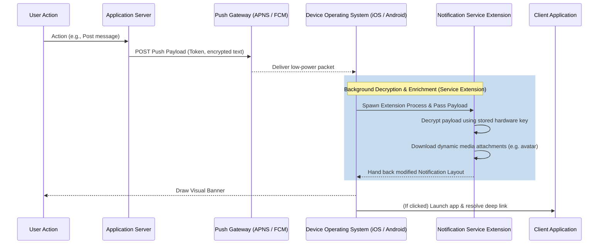

# Mobile System Design: Push Notification Delivery Pipeline

This system design document maps the lifecycle of remote push notifications, from backend triggers to client-side presentation layers.

---

## 1. End-to-End Delivery Flow

Push notifications route payloads to mobile devices using Apple Push Notification service (APNS) or Firebase Cloud Messaging (FCM) to conserve cellular radios and device battery:

---

## 2. Low-Power Wakeups & Data Pushes

To update client state silently before the user unlocks the screen:
* **Silent Push Notifications**: Contain no visual alert values (`title`, `body`). Upon receipt, the OS wakes the client background process and grants a short execution window ($30$ seconds on iOS) to perform DB syncing, outbox cleaning, or telemetry flushing.
* **Throttling Rules**: The OS monitors silent push volume. Excessive silent notifications will trigger background execution blocks to protect battery health.

---

## 3. Security: Client-Side Decryption

To support absolute end-to-end security (e.g. Signal, WhatsApp):
1. **Encrypted Payloads**: The push gateway only receives encrypted text.
2. **Service Extension Isolation**: On receipt, the OS runs a lightweight **Notification Service Extension** (iOS) or Background Worker (Android). The extension retrieves the private key from the device's secure hardware store (Keychain/Keystore), decrypts the payload in memory, and presents the clean text to the user. The plaintext never touches the push gateway or persistent server logs.
