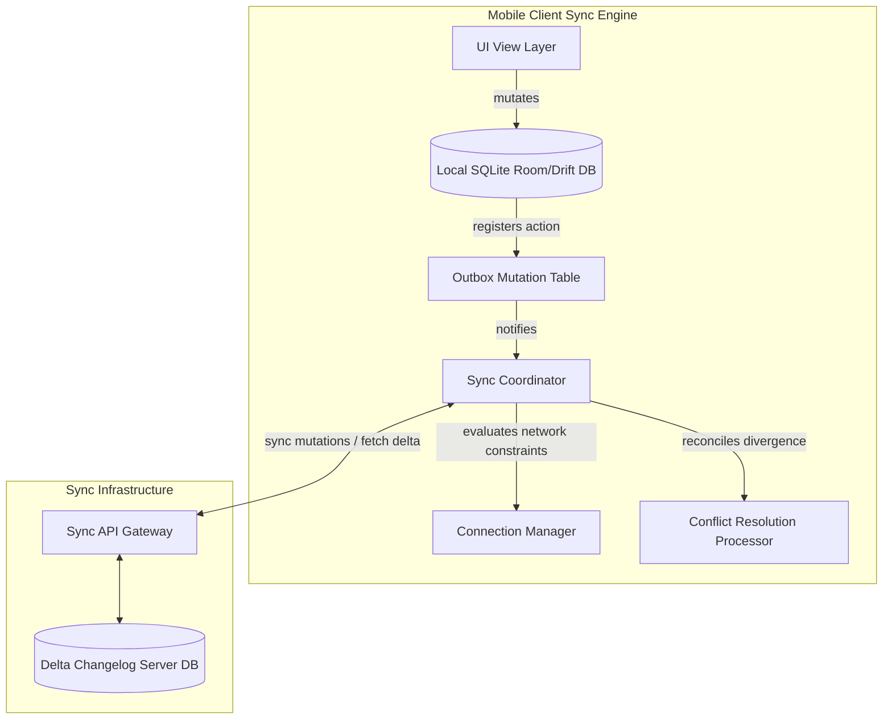

# Mobile System Design: Offline-First Synchronization Engine

This document describes the comprehensive architecture, protocol designs, conflict resolution models, and task retry loops for an **Offline-First Synchronization Engine** that ensures local client mutability, network adaptability, and eventual consistency.

---

## 1. High-Level Architecture

The sync engine coordinates mutations locally first, utilizing a Local database as the Single Source of Truth (SSOT). The UI only observes local database streams.



---

## 2. Synchronization Protocols: Delta Sync vs. Pull

To save client cellular data and reduce server load, we avoid downloading the full database payload on every sync trigger. Instead, we run **Delta Synchronization**:
1. The client maintains a local key-value preference tracking the last successful transaction epoch: `last_sync_timestamp`.
2. On sync triggers, the client requests `GET /sync/delta?since_timestamp=last_sync_timestamp`.
3. The server scans its delta changesets and returns *only* the records modified, inserted, or deleted since that timestamp.
4. The client applies updates locally (using soft deletes to wipe deleted records) and updates its local `last_sync_timestamp` to the current server epoch.

---

## 3. The Local Outbox Pattern (Offline Queue)

When the user performs mutations while offline (e.g. posting a message, modifying profile details):
1. **Optimistic Mutation**: The item is instantly written to the local database table with `status = PENDING`.
2. **Optimistic UI**: The UI observes the DB, so the new item appears instantly in the list with a loading/pending indicator.
3. **Outbox Registration**: An entry is appended to the `outbox` queue table:
   ```sql
   CREATE TABLE outbox (
       id TEXT PRIMARY KEY,
       action_type TEXT, -- e.g., 'CREATE_POST', 'UPDATE_BIO'
       payload TEXT, -- Serialized JSON/Protobuf payload
       created_at INTEGER
   );
   ```
4. **Execution Intercept**: The connection manager monitors network states. Once Wi-Fi/Cellular connectivity returns:
   * It extracts outbox items in chronological order.
   * Posts mutations to the backend.
   * Upon HTTP success, it updates the record status to `COMPLETED` or deletes it, and triggers a UI update.

---

## 4. Conflict Resolution: Last-Write-Wins (LWW) vs. CRDTs

When multiple clients mutate duplicate records offline:
* **Last-Write-Wins (LWW)**: Simple, timestamp-driven. The update with the latest device timestamp overrides older states.
  * *Vulnerability*: Client clock drift can corrupt updates.
* **Conflict-free Replicated Data Types (CRDTs)**: Mathematically structured types (like state-based LWW-Element-Sets) that merge changes deterministically, guaranteeing consistency without central backend ordering.

---

## 5. Retries with Exponential Backoff and Jitter

To prevent hammering the API server during network outages, retries use **Exponential Backoff and Jitter**:
$$\text{Delay} = \min\left(\text{maxDelay}, \text{base} \times 2^{\text{retryCount}}\right) + \text{randomJitter}$$

---

## 6. Implementation

### 1. Outbox Queue Engine

#### Dart
```dart
class OutboxTask {
  final String id;
  final String action; // e.g. "CREATE_POST", "LIKE_COMMENT"
  final String payload;
  bool isSyncing = false;

  OutboxTask(this.id, this.action, this.payload);
}

class OutboxSyncEngine {
  final List<OutboxTask> _outbox = [];

  void addMutation(String action, String payload) {
    final task = OutboxTask(DateTime.now().toIso8601String(), action, payload);
    _outbox.add(task);
    triggerSync();
  }

  Future<void> triggerSync() async {
    for (var task in _outbox) {
      if (task.isSyncing) continue;
      
      task.isSyncing = true;
      try {
        await _networkPost(task.action, task.payload);
        // Remove task on successful sync
        _outbox.removeWhere((t) => t.id == task.id);
        break; // Break loop to avoid concurrent modification issues, call triggerSync again
      } catch (e) {
        task.isSyncing = false;
        print("Failed to sync task: ${task.id}, retrying later...");
        break; // Network failed, pause queue processing
      }
    }
  }

  Future<void> _networkPost(String action, String payload) async {
    await Future.delayed(Duration(milliseconds: 200)); // Simulated delay
  }
}
```

#### Kotlin
```kotlin
import java.util.concurrent.CopyOnWriteArrayList
import kotlinx.coroutines.delay

class OutboxTask(
    val id: String,
    val action: String,
    val payload: String,
    var isSyncing: Boolean = false
)

class OutboxSyncEngine {
    private val outbox = CopyOnWriteArrayList<OutboxTask>()

    fun addMutation(action: String, payload: String) {
        val task = OutboxTask(System.currentTimeMillis().toString(), action, payload)
        outbox.add(task)
    }

    suspend fun triggerSync() {
        for (task in outbox) {
            if (task.isSyncing) continue
            task.isSyncing = true
            try {
                networkPost(task.action, task.payload)
                outbox.remove(task)
            } catch (e: Exception) {
                task.isSyncing = false
                println("Failed to sync task: ${task.id}, pausing sync queue...")
                break // Network failed, pause queue
            }
        }
    }

    private suspend fun networkPost(action: String, payload: String) {
        delay(200) // Simulated delay
    }
}
```

### 2. Backoff Retry Implementation

#### Dart
```dart
import 'dart:math';

class NetworkRetryEngine {
  final int maxRetries;
  final double baseDelaySeconds;
  
  NetworkRetryEngine({this.maxRetries = 5, this.baseDelaySeconds = 2.0});

  Future<T> executeWithRetry<T>(Future<T> Function() networkOperation) async {
    int attempts = 0;
    final random = Random();

    while (true) {
      try {
        return await networkOperation();
      } catch (e) {
        attempts++;
        if (attempts >= maxRetries) {
          rethrow; // Max attempts exceeded
        }

        // Exponential backoff calculation
        final backoff = baseDelaySeconds * pow(2, attempts);
        
        // Full Jitter addition
        final jitter = random.nextDouble() * backoff;
        
        print("Network failed. Retrying in ${jitter.toStringAsFixed(2)} seconds...");
        await Future.delayed(Duration(milliseconds: (jitter * 1000).toInt()));
      }
    }
  }
}
```

#### Kotlin
```kotlin
import kotlin.math.pow
import kotlin.random.Random
import kotlinx.coroutines.delay

class NetworkRetryEngine(
    private val maxRetries: Int = 5,
    private val baseDelaySeconds: Double = 2.0
) {
    suspend fun <T> executeWithRetry(networkOperation: suspend () -> T): T {
        var attempts = 0
        while (true) {
            try {
                return networkOperation()
            } catch (e: Exception) {
                attempts++
                if (attempts >= maxRetries) {
                    throw e
                }

                // Exponential backoff
                val backoff = baseDelaySeconds * 2.0.pow(attempts)
                
                // Full Jitter
                val jitter = Random.nextDouble(0.0, backoff)
                
                println("Network failed. Retrying in ${String.format("%.2f", jitter)} seconds...")
                delay((jitter * 1000).toLong())
            }
        }
    }
}
```
