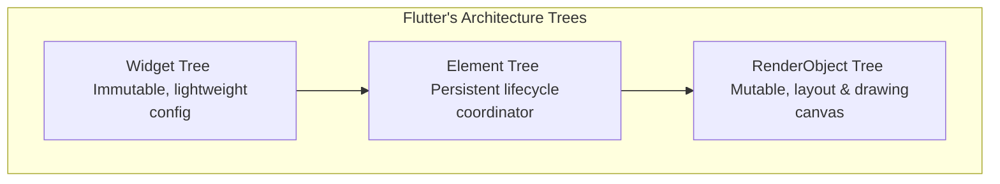

# Mobile UI Rendering Pipelines

This document details client-side rendering engines, layout cycles, drawing commands, and pixel-compositor pipelines across cross-platform (Flutter) and native (Android/iOS) mobile environments.

---

## 1. The Rendering Challenge: Keeping 60Hz/120Hz Rates

Mobile viewports must update at constant intervals to achieve smooth UI transitions without stutter:
* **60Hz Refreshes**: A new frame must build, layout, paint, and rasterize within **$16.6\text{ms}$**.
* **120Hz Refreshes**: The budget drops to **$8.3\text{ms}$**.

If any phase (layout calculations, heavy main-thread operations, GC sweeps) exceeds this budget, the system drops the frame, producing visible stutter (jank).

---

## 2. Flutter's Three-Tree Rendering Engine

Unlike traditional cross-platform frameworks that wrap native platform views, Flutter compiles its logic and paints directly onto a hardware graphics canvas using **Impeller** or **Skia**. To manage this efficiently, it maintains three parallel trees:

### The Separation of Concerns
1. **Widget Tree (Immutable & Declarative)**:
   * Describes the layout configuration. Widgets are highly transient, instantiated constantly during builds, and cheap to allocate and garbage collect.
2. **Element Tree (Mutable & Persistent)**:
   * Glues the immutable configurations to the physical drawing nodes. It manages the runtime lifecycle of states.
   * **State Preservation**: During rebuilds, Flutter compares the new widget's type and key with the active Element (`Widget.canUpdate`). If they match, the element updates its widget reference without recreating the expensive `RenderObject`.
3. **RenderObject Tree (Mutable & Compute-Heavy)**:
   * Handles size measurement (`performLayout()`) and paint command rendering (`paint()`).

---

## 3. Native Platform Rendering Architectures

To bridge cross-platform concepts with native systems, senior engineers must understand native rendering lifecycles:

### Native Android (View Hierarchy & Draw Passes)
Android views draw layout hierarchies sequentially on the Main Thread via the **Choreographer** class:
1. **Measure Pass**: The view tree is traversed top-down. Every parent view passes layout limits (e.g., wrap-content, match-parent) to its children, which measure their exact pixel dimensions and report them back.
2. **Layout Pass**: Parents position children inside parent boundary coordinates.
3. **Draw Pass**: The system generates drawing instructions (display lists) and pushes them to the **RenderThread**, which uses OpenGL/Vulkan to draw pixels.

### Native iOS (CoreAnimation & Layout Passes)
iOS matches layout configurations with visual presentation layers:
1. **Layout Pass (`layoutSubviews`)**: Positions views inside parent frame boundaries.
2. **Commit Transaction**: The CPU processes layouts, decodes images, and serializes drawing commands.
3. **Render Server (GPU)**: The iOS Render Server process receives draw packets, processes CoreAnimation layer configurations (`CALayer`), and draws pixels on the screen.

---

## 4. Layout Constraints Rules

Both Flutter and native systems optimize tree layout computations using strict top-down constraint models:

* **Constraints Go Down**: Parents set constraints (minimum/maximum limits for width and height).
* **Sizes Go Up**: Children compute their dimensions within those limits and report their sizes back up to parents.
* **Parent Positions Child**: Parents locate children on the layout coordinate grid using the computed child sizes.

This single-pass tree traversal operates in linear $O(N)$ complexity, preventing quadratic layout loops.
