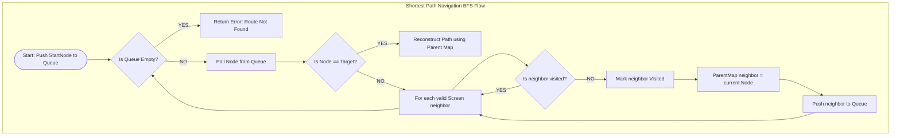

# BFS Navigation System & Deep-Link Route Resolution

## 1. Context and Problem Statement
Modern mobile applications organize screens as dynamic view modules. Navigating between views behaves like traversing nodes in a **Graph**:
* **Nodes**: Screens or feature modules (e.g. `Home`, `Details`, `Cart`, `Checkout`).
* **Edges**: Valid transition pathways or routing boundaries between screens.

When a user receives a deep-link path (e.g., launching directly into a specific nesting sub-screen `myapp://checkout/cart`), the navigation engine must determine if a valid route exists and resolve the shortest sequence of view state transitions to reconstruct the navigation backstack safely. We solve this shortest-path unweighted routing challenge using **Breadth-First Search (BFS)**.

---

## 2. Design Architecture: BFS Traversal

Breadth-First Search (BFS) is a graph traversal algorithm that explores all neighbor nodes at the current depth level before moving to nodes at the next depth level. Since it explores nodes radially, BFS is mathematically guaranteed to find the **shortest path** between two nodes in an unweighted graph.

```
       [Home] ---> [Settings] ---> [Profile]
         |
         +-------> [Details] ----> [Cart] ----> [Checkout]
```

### BFS Routing Pipeline
1. **Adjacency List Structure**: Screens are represented as nodes. We construct a `Map<Screen, List<Screen>>` representing valid paths.
2. **Queue-Based Traversal**: We start at the current screen node and push it onto a Queue.
3. **Visitation Tracking**: A `Set` tracks visited nodes to prevent cycles (loops where screen transitions cycle back to the start).
4. **Backpointer Tracking**: To reconstruct the shortest path route, we maintain a parent tracking Map (`Map<Screen, Screen>`). Once the target screen is reached, we backtrack from the target back to the start to construct the exact navigation route sequence.



---

## 3. Real-World Mobile Engineering Use Cases

### 1. Dynamic Deep-Link Path Resolvers
* Deep links direct users to nested sub-screens. When a user clicks a deep link, the navigation controller runs a BFS to build the exact screen backstack sequence (e.g., pushing `Home` $\to$ `ProductDetails` $\to$ `CartPage` sequentially) so that clicking the system back button returns the user to the logical parent views, preserving native navigation behavior.

---

## 4. Complexity & Tradeoffs

* **Time Complexity:** $O(V + E)$ where $V$ is the number of screen nodes and $E$ is the number of transition edges. We inspect every screen and valid transition pathway once in the worst case.
* **Space Complexity:** $O(V)$ auxiliary space to allocate the queue, visited set, and parent maps.
* **Tradeoffs:** BFS requires allocating memory structures ($O(V)$ queue space). For massive graph systems, DFS consumes slightly less memory if the target is extremely deep, but DFS does *not* guarantee the shortest path, making BFS the absolute standard for unweighted routing.

---

## 5. Implementation References

* **Kotlin Implementation:** [`bfs_kotlin.kt`](./bfs_kotlin.kt)
* **Dart Implementation:** [`bfs_dart.dart`](./bfs_dart.dart)
