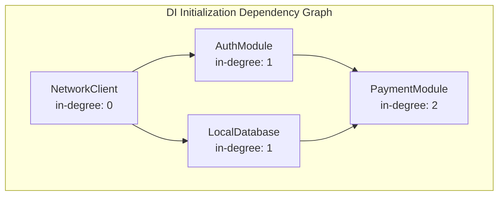

# Dependency Graph & Topological Sorting (Kahn's Algorithm)

## 1. Context and Problem Statement
When developing large-scale mobile applications, we split the codebase into discrete feature modules and classes. During application startup, these modules must be initialized in a specific sequence:
* **The Dependency Constraint**: If `Module B` depends on `Module A` (e.g. `PaymentModule` depends on `NetworkClient`), `Module A` **must** be initialized completely *before* `Module B` starts initialization.
* **The Cycle Threat**: If a circular dependency exists (e.g. Class A depends on Class B, Class B depends on Class C, and Class C depends on Class A), the app initialization will lock up or crash.

We represent feature modules as nodes in a **Directed Acyclic Graph (DAG)**. We must compute a linear ordering of vertices such that for every directed edge $u \to v$, node $u$ comes before $v$ in the ordering. This process is called **Topological Sorting**, and we solve it in linear time using **Kahn's Algorithm**.

---

## 2. Design Architecture: Kahn's Algorithm

Kahn's Algorithm resolves topological sorting using **In-degrees** (the number of incoming edges to a node):
1. **In-degree Calculation**: Compute the in-degree for every vertex in the graph.
2. **Zero In-degree Queue**: Identify all vertices with an in-degree of `0` (nodes that have no dependencies) and push them onto a Queue.
3. **Traverse & Decrement**:
   * Poll a node from the Queue and append it to our sorted initialization output list.
   * For each neighbor connected to this node, decrement its in-degree by `1` (simulating that its dependency has been satisfied).
   * If a neighbor's in-degree reaches `0`, push it onto the Queue.
4. **Cycle Discovery**: If the output list length does not match the total number of vertices in the graph, it is mathematically proven that a **circular dependency cycle** exists, allowing us to abort and report compile-time errors rather than shipping a buggy app.



---

## 3. Real-World Mobile Engineering Use Cases

### 1. Dependency Injection Framework Compilers (Hilt, Koin, GetIt)
* DI tools map class constructors. During compilation or startup, they build a dependency graph and run topological sorting to ensure that databases, clients, and repositories initialize in strict order, flagging cyclic dependencies instantly.

### 2. Multi-Module Startup Schedulers
* Large enterprise apps contain 50+ modular libraries. To optimize cold startup time, they run Kahn's algorithm to resolve module dependencies. Independent branches (with zero in-degrees) are scheduled to initialize in parallel background threads, cutting startup latency.

---

## 4. Complexity & Tradeoffs

* **Time Complexity:** $O(V + E)$ where $V$ is features/classes and $E$ is dependency connections.
* **Space Complexity:** $O(V)$ auxiliary space to track in-degree maps and queues.
* **Tradeoffs:** Kahn's Algorithm runs recursively on startup. For massive apps with thousands of classes, running this sorting reflection-free at compile-time (e.g. using Annotation Processors or KSP) protects runtime cold launch benchmarks.

---

## 5. Implementation

### Kotlin
```kotlin
import java.util.LinkedList
import java.util.Queue

class DependencySorter {
    fun resolveStartupOrder(
        modules: List<String>,
        dependencies: Map<String, List<String>>
    ): List<String> {
        val inDegree = HashMap<String, Int>()
        val adjList = HashMap<String, MutableList<String>>()

        // Initialize structures
        for (module in modules) {
            inDegree[module] = 0
            adjList[module] = ArrayList()
        }

        // Build Graph and calculate In-degrees
        for ((module, deps) in dependencies) {
            for (dep in deps) {
                // Dependency: dep must initialize BEFORE module (dep -> module)
                adjList.putIfAbsent(dep, ArrayList())
                adjList[dep]?.add(module)
                inDegree[module] = inDegree.getOrDefault(module, 0) + 1
            }
        }

        // Queue all nodes with 0 in-degree (no dependencies)
        val queue: Queue<String> = LinkedList()
        for (module in modules) {
            if (inDegree[module] == 0) {
                queue.add(module)
            }
        }

        val order = ArrayList<String>()
        while (!queue.isEmpty()) {
            val current = queue.poll()
            order.add(current)

            val neighbors = adjList[current] ?: continue
            for (neighbor in neighbors) {
                inDegree[neighbor] = inDegree[neighbor]!! - 1
                if (inDegree[neighbor] == 0) {
                    queue.add(neighbor)
                }
            }
        }

        // Cycle Check
        if (order.size != modules.size) {
            throw IllegalStateException("Cyclic Dependency Discovered! Cannot safely initialize.")
        }

        return order
    }
}
```

### Dart
```dart
import 'dart:collection';

class DependencySorter {
  List<String> resolveStartupOrder(
    List<String> modules,
    Map<String, List<String>> dependencies,
  ) {
    final Map<String, int> inDegree = {};
    final Map<String, List<String>> adjList = {};

    for (final String module in modules) {
      inDegree[module] = 0;
      adjList[module] = [];
    }

    // Build Graph and compute in-degrees
    dependencies.forEach((module, deps) {
      for (final String dep in deps) {
        adjList.putIfAbsent(dep, () => []);
        adjList[dep]?.add(module);
        inDegree[module] = (inDegree[module] ?? 0) + 1;
      }
    });

    final ListQueue<String> queue = ListQueue<String>();
    for (final String module in modules) {
      if (inDegree[module] == 0) {
        queue.addLast(module);
      }
    }

    final List<String> order = [];
    while (queue.isNotEmpty) {
      final String current = queue.removeFirst();
      order.add(current);

      final neighbors = adjList[current] ?? [];
      for (final String neighbor in neighbors) {
        inDegree[neighbor] = (inDegree[neighbor] ?? 1) - 1;
        if (inDegree[neighbor] == 0) {
          queue.addLast(neighbor);
        }
      }
    }

    if (order.length != modules.length) {
      throw StateError("Cyclic Dependency Discovered! Cannot safely initialize.");
    }

    return order;
  }
}
```
