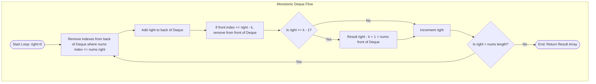

# Sliding Window Maximum

## 1. Problem Statement
You are given an array of integers `nums`, there is a sliding window of size `k` which is moving from the very left of the array to the very right. You can only see the `k` numbers in the window. Each time the sliding window moves right by one position.

Return the max sliding window values.

* **Example 1:**
  * Input: `nums = [1,3,-1,-3,5,3,6,7]`, `k = 3`
  * Output: `[3,3,5,5,6,7]`
  * Explanation: 
    * Window position `[1,  3, -1]` $\to$ Max: `3`
    * Window position ` 1, [3, -1, -3]` $\to$ Max: `3`
    * Window position ` 1,  3, [-1, -3, 5]` $\to$ Max: `5`
    * Window position ` 1,  3, -1, [-3, 5, 3]` $\to$ Max: `5`
    * Window position ` 1,  3, -1, -3, [5, 3, 6]` $\to$ Max: `6`
    * Window position ` 1,  3, -1, -3,  5, [3, 6, 7]` $\to$ Max: `7`

---

## 2. Pattern Explanation: Monotonic Double-Ended Queue (Deque)

A brute-force solution checks all `k` elements in the window at each slide step, yielding $O(N \times k)$ time complexity, which stutters when $k$ is large.

To solve this in $O(N)$ linear time, we use a **Monotonic Deque** (Double-Ended Queue) that stores array indices. We maintain the Deque in a **decreasing monotonic order**:
1. When a new element arrives, we remove all indices from the back of the Deque whose corresponding values are less than or equal to the new value (since they can never be the maximum in any present or future window).
2. We add the new element's index to the back of the Deque.
3. We check the front of the Deque. If the index at the front is outside our active window (`front_index <= right - k`), we remove it.
4. The element at the front of the Deque is always the maximum value in our current window.



---

## 3. Real-World Mobile Engineering Use Cases

### 1. Viewport Prefetching & Large Media Card Rendering
* In list feeds containing videos, high-resolution cards, or live streams, the app must determine which item holds the highest rendering priority (e.g. which element is the most prominent or has the largest view boundaries) within a rolling vertical view window. Using a sliding window maximum over cell visibility bounds allows the UI thread to instantly select and allocate GPU memory to the focal asset, keeping scrolling fluid.

### 2. High-Frequency Real-Time Audio Volumetric Smoothing
* Real-time audio recorders analyze input frequencies in chunks to render waveform animations. A sliding window maximum computes peak input amplitudes across a moving window, filtering out static clicks and smoothing the waveform transitions.

---

## 4. Complexity & Tradeoffs

* **Time Complexity:** $O(N)$ linear time. Although there is a nested loop to clean up the Deque, each array index is pushed and popped from the Deque at most once.
* **Space Complexity:** $O(k)$ auxiliary space to store indices in the Monotonic Deque.
* **Tradeoffs:** Monotonic queues require custom Deque structures (especially in Dart, which has a standard `Queue` but lacks a dedicated double-ended index array queue). Writing a lightweight Array-backed index pointer structure avoids excessive class allocations.

---

## 5. Implementation

### Kotlin
```kotlin
import java.util.ArrayDeque

class SlidingWindowSolver {
    fun maxSlidingWindow(nums: IntArray, k: Int): IntArray {
        if (nums.isEmpty()) return intArrayOf()
        val n = nums.size
        val result = IntArray(n - k + 1)
        val deque = ArrayDeque<Int>() // Stores indices of array elements

        var resultIdx = 0
        for (i in 0 until n) {
            // 1. Remove indices of elements smaller than the current element from the back
            while (!deque.isEmpty() && nums[deque.peekLast()] <= nums[i]) {
                deque.pollLast()
            }

            // 2. Add current element's index
            deque.offerLast(i)

            // 3. Remove indices that are outside the current sliding window bounds
            if (deque.peekFirst() <= i - k) {
                deque.pollFirst()
            }

            // 4. Record maximum once the window has fully formed (index >= k - 1)
            if (i >= k - 1) {
                result[resultIdx++] = nums[deque.peekFirst()]
            }
        }

        return result
    }
}
```

### Dart
```dart
import 'dart:collection';

class SlidingWindowSolver {
  List<int> maxSlidingWindow(List<int> nums, int k) {
    if (nums.isEmpty) return [];
    final int n = nums.length;
    final List<int> result = List.filled(n - k + 1, 0);
    final DoubleLinkedQueue<int> deque = DoubleLinkedQueue<int>(); // Stores indices

    int resultIdx = 0;
    for (int i = 0; i < n; i++) {
      // 1. Evict smaller elements from the back of the queue
      while (deque.isNotEmpty && nums[deque.last] <= nums[i]) {
        deque.removeLast();
      }

      // 2. Insert current index
      deque.addLast(i);

      // 3. Evict indices outside the sliding window boundary
      if (deque.first <= i - k) {
        deque.removeFirst();
      }

      // 4. Extract max when window is complete
      if (i >= k - 1) {
        result[resultIdx++] = nums[deque.first];
      }
    }

    return result;
  }
}
```
