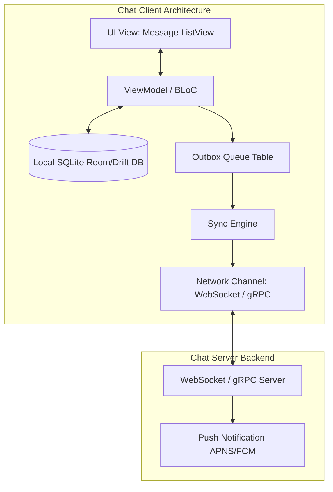

# Mobile System Design: Real-Time Chat Client Architecture

This document describes the detailed client-side system design for a scalable, offline-first real-time chat application.

---

## 1. High-Level Architecture Overview

A production chat client coordinates real-time network streams, persistent caching, and a reactive UI:

---

## 2. Protocols: WebSockets vs. gRPC Bidirectional Streams

For duplex real-time communication:
1. **WebSockets**:
   * **Pros**: Simple, highly compatible.
   * **Cons**: No native schema validation (sends raw text/JSON frames). Heartbeat ping/pong must be implemented manually.
2. **gRPC Bidirectional Streaming**:
   * **Pros**: Native typing via Protocol Buffers. Extremely small binary size in transit, which saves battery and data plan. Native flow-control support.
   * **Cons**: High backend proxy setup cost.

---

## 3. Data Synchronization & Cursor Reconciliation

When the client transitions from offline to online:
* **The Problem**: Requesting full message history is heavy and expensive.
* **The Solution**: The local database maintains the largest parsed `sequence_id` or `timestamp` for every active chat room. On reconnect, the client issues a REST/gRPC query: `GET /chat/sync?after_id={latest_local_id}`. The server streams the delta messages, which the client injects into the local DB in a single SQL transaction. Since the UI listens to the DB query, the screen renders new messages seamlessly.

---

## 4. Bounded Local Outbox Pattern

To allow users to type and send messages while disconnected:
1. **Insert Pending**: The message is instantly saved in the local DB with a state of `send_status = PENDING`.
2. **Optimistic UI Render**: The chat bubble displays a gray clock icon.
3. **Outbox Entry**: An entry is appended to the local `outbox` table.
4. **Network Dispatch**: A sync worker processes the outbox chronological queue once network returns.
5. **ACK Handshake**: The server returns the final `message_id` and `timestamp`. The client updates the DB state to `status = SENT`. The clock icon changes to a checkmark in the UI.
