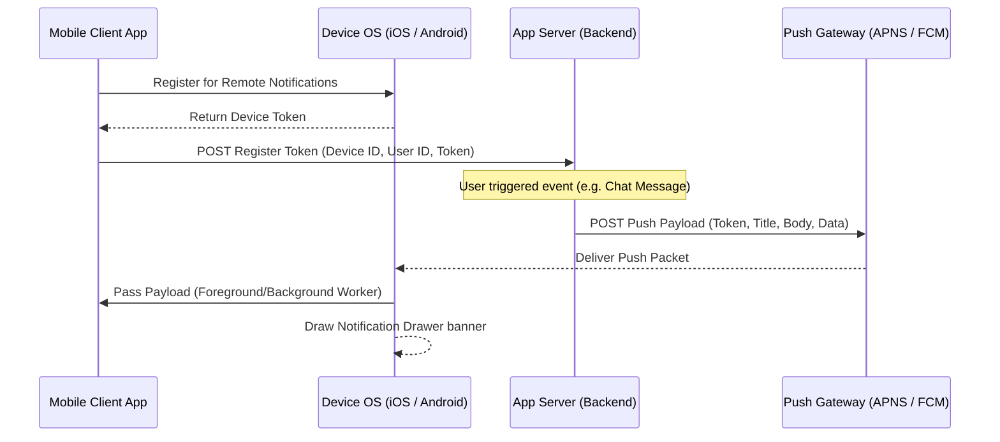

# Mobile System Design: Push Notification Architecture

This document describes the end-to-end client-side system design for a scalable push notification system, integrating APNS (Apple Push Notification service) and FCM (Firebase Cloud Messaging).

---

## 1. High-Level Delivery Flow

Push notifications rely on a secure intermediary gateway provided by Apple or Google to deliver payloads to devices without maintaining persistent background connections on the client, which would drain battery.

---

## 2. Push Notification Types & States

Notifications arrive in two distinct modes, and their handling varies depending on the app's execution state:

### 1. Alert Notifications (Visual Banner)
* **Design**: Standard visual banners drawn immediately on screen.
* **Payload**: Contains high-level structural properties like `title`, `body`, `sound`, `badge`.

### 2. Silent / Data Notifications
* **Design**: Does not draw a UI banner automatically. Instead, the OS wakes the app in the background and grants a short execution window ($30$ seconds on iOS) to perform task processing.
* **Relevance**: Synchronizing databases, prefetching new feed contents, or updating internal state before the user opens the application.

### App Execution States
* **Foreground**: The application is active and open on screen. The OS bypasses the notification banner and passes the payload directly to the app's running execution listeners.
* **Background / Suspended**: The app is minimized. The OS draws the banner in the drawer. Clicking it launches the app, passing the target deep-link data to the router.
* **Terminated**: The app is completely killed. The OS draws the banner. Tapping the banner launches the application, passing the payload inside the launch parameters.

---

## 3. Payload Limits & Serialization Constraints

Push gateways enforce strict payload size constraints:
* **APNS (Apple)**: Maximum payload size is **4 KB** for standard notifications and **2 KB** for silent/data notifications.
* **FCM (Google)**: Maximum payload size is **4 KB** for data payloads.

### Architectural Best Practices
* **Don't Send Heavy Data**: Never pass full chat histories, images, or large payloads through the notification gateway. APNS/FCM can drop packets if sizes are exceeded.
* **Use ID-Only Payloads**: Send only thin structural IDs (e.g., `message_id`, `chat_room_id`). Upon receipt, the background client wakes up and runs a rapid network fetch (`GET /message/{id}`) to securely retrieve full details from the database.

---

## 4. Client-Side Processing Pipeline

To secure and enrich push notifications:

1. **Decryption**: If notifications are end-to-end encrypted (e.g., in Signal), the notification contains encrypted text. The client must run a Notification Service Extension (iOS) or a background service (Android) to decrypt the payload on device using stored local keys before rendering the banner.
2. **Dynamic Media Attachment**: To display rich media (like images or avatars inside notification bubbles), the service extension extracts the media URL from the payload, downloads the image file locally, caches it, and attaches it to the notification banner before presentation.
3. **De-duplication**: Maintain a lightweight historical table of processed `notification_ids`. If a network glitch causes APNS/FCM to deliver a push twice, check the ID and suppress duplicates to prevent user annoyance.
