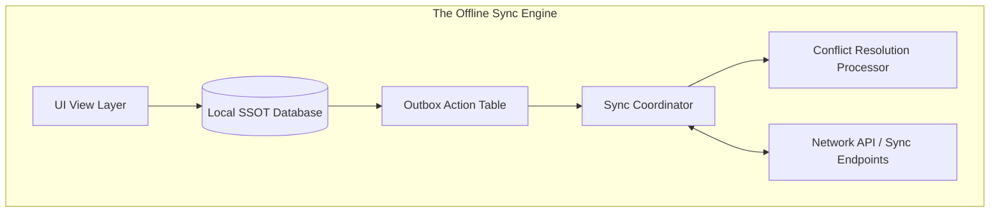

# Mobile System Design: Offline Sync Engine Architecture

This document describes the detailed architecture of an Offline-First Sync Engine that ensures seamless client mutability and data integrity under variable network connectivity.

---

## 1. Engine Core Pillars

An offline-first sync engine coordinates local modifications with backend databases using three fundamental pillars:
1. **Local Single Source of Truth (SSOT)**: The user interface *only* queries the local database. It never communicates directly with network responses. This guarantees sub-millisecond screen transition times.
2. **Dynamic Transaction Queue**: All offline operations are recorded inside an outbox queue and processed sequentially.
3. **Conflict Resolution Processor**: Reconciles divergence when multiple clients mutate identical database records offline.



---

## 2. Synchronization Protocols: Delta Sync vs. Pull

To save cellular data limits and prevent unnecessary backend queries:

### 1. Simple Full Pull (Discouraged)
* **Design**: Re-downloading the full database payload on every launch.
* **Tradeoff**: Incredibly heavy on network data, slow loading times, and high API server costs.

### 2. Delta Synchronization (Best Practice)
* **Design**: The client tracks a global local version state: `last_sync_timestamp`.
* **Execution**:
  1. The client queries: `GET /sync/delta?since_timestamp=1716035000`.
  2. The server scans its delta tables and returns *only* the records that have changed, been inserted, or deleted since that timestamp.
  3. The client applies updates locally (using soft deletes to wipe deleted records) and updates its local `last_sync_timestamp` to the current server epoch.

---

## 3. Conflict Resolution: Last-Write-Wins (LWW) vs. CRDTs

When multiple offline clients modify the same record, conflicts occur:

### 1. Last-Write-Wins (LWW)
* **Mechanism**: Every modification is stamped with a precise UTC timestamp. The update with the newest timestamp overrides older mutations.
* **Pros**: Simple to understand and implement.
* **Cons**: Highly vulnerable to client clock drift. If a user's device clock is slow, their legitimate mutations will be discarded.

### 2. Conflict-free Replicated Data Types (CRDTs)
* **Mechanism**: Mathematically structured data types (like Grow-only Sets or LWW-Element-Sets) that can merge changes deterministically without requiring coordination or central server ordering.
* **Pros**: Incredibly robust, mathematically guaranteed merge consistency across thousands of distributed offline nodes (e.g. collaborative text editors).
* **Cons**: Extremely complex to write and maintain on client runtimes.

---

## 4. Retries with Exponential Backoff and Jitter

If a sync mutation fails due to connection loss, the sync engine must retry *without* hammering the backend server (which could cause a self-inflicted Distributed Denial of Service (DDoS) during outages).

### The Math
1. **Exponential Backoff**: Multiply retry delays by a constant factor on consecutive failures:
   $$\text{Delay} = \text{base} \times 2^{\text{retryCount}}$$
2. **Jitter (Randomization)**: Add random noise to the delay to stagger concurrent clients trying to reconnect simultaneously:
   $$\text{DelayWithJitter} = \text{random}(0, \text{Delay})$$

### Custom Retry Engine Implementations

#### Dart
```dart
import 'dart:math';

class NetworkRetryEngine {
  final int maxRetries;
  final double baseDelaySeconds;
  
  NetworkRetryEngine({this.maxRetries = 5, this.baseDelaySeconds = 2.0});

  Future<T> executeWithRetry<T>(Future<T> Function() networkOperation) async {
    int attempts = 0;
    final random = Random();

    while (true) {
      try {
        return await networkOperation();
      } catch (e) {
        attempts++;
        if (attempts >= maxRetries) {
          rethrow; // Max attempts exceeded
        }

        // Exponential backoff calculation
        final backoff = baseDelaySeconds * pow(2, attempts);
        
        // Full Jitter addition
        final jitter = random.nextDouble() * backoff;
        
        print("Network failed. Retrying in ${jitter.toStringAsFixed(2)} seconds...");
        await Future.delayed(Duration(milliseconds: (jitter * 1000).toInt()));
      }
    }
  }
}
```

#### Kotlin
```kotlin
import kotlin.math.pow
import kotlin.random.Random
import kotlinx.coroutines.delay

class NetworkRetryEngine(
    private val maxRetries: Int = 5,
    private val baseDelaySeconds: Double = 2.0
) {
    suspend fun <T> executeWithRetry(networkOperation: suspend () -> T): T {
        var attempts = 0
        while (true) {
            try {
                return networkOperation()
            } catch (e: Exception) {
                attempts++
                if (attempts >= maxRetries) {
                    throw e
                }

                // Exponential backoff
                val backoff = baseDelaySeconds * 2.0.pow(attempts)
                
                // Full Jitter
                val jitter = Random.nextDouble(0.0, backoff)
                
                println("Network failed. Retrying in ${String.format("%.2f", jitter)} seconds...")
                delay((jitter * 1000).toLong())
            }
        }
    }
}
```
