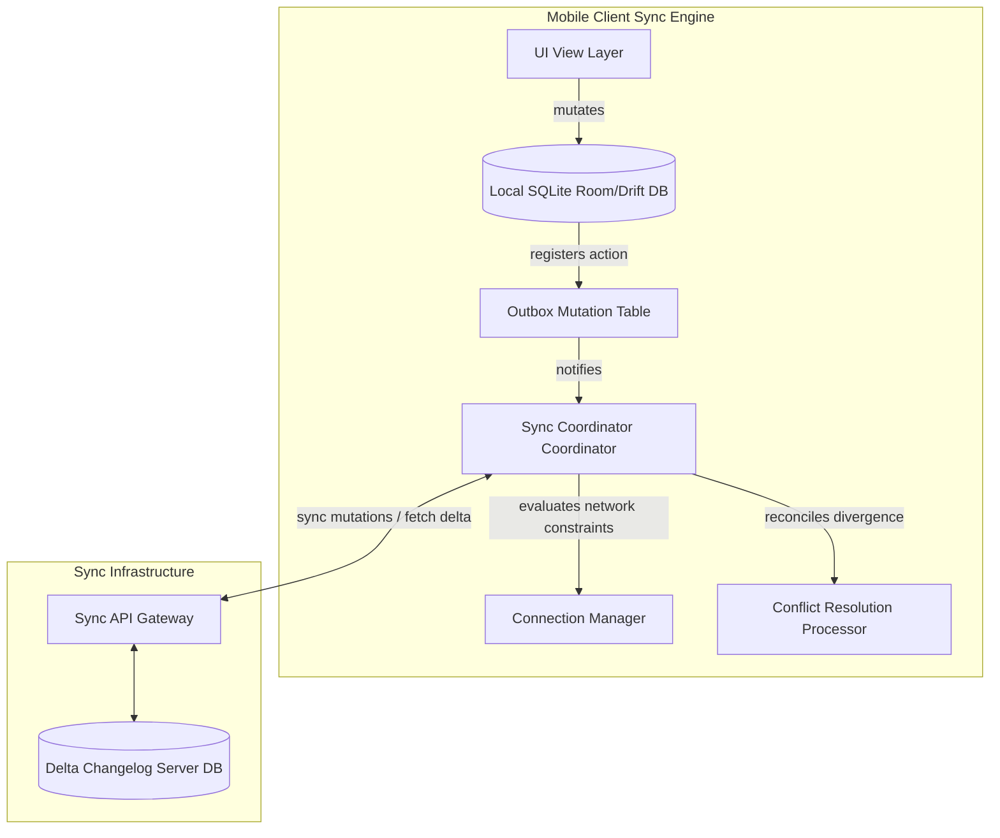

# Mobile System Design: Offline-First Synchronization Engine

This system design document describes the comprehensive architecture of an **Offline-First Synchronization Engine** that ensures local client mutability, network adaptability, and eventual data consistency.

---

## 1. High-Level Architecture

The sync engine coordinates mutations locally first, utilizing a Local database as the Single Source of Truth (SSOT). The UI only observes local database streams.



---

## 2. Adaptive Protocol: Pull vs. Delta Sync

To optimize dynamic cellular data usage and prevent server load, the engine implements **Delta Synchronization**:
* **The Process**:
  1. The client maintains a local key-value preference tracking the last successful transaction epoch: `last_sync_timestamp`.
  2. On sync triggers, the client requests `GET /sync/delta?since_timestamp=last_sync_timestamp`.
  3. The server queries its delta changesets and returns only records mutated since that epoch.
  4. The client applies the delta updates inside a single SQLite transaction and updates `last_sync_timestamp` to the server's current timestamp.

---

## 3. Dynamic Local Outbox Queue (Offline Queue)

When the user performs mutations while offline (e.g. posting a message, modifying profile details):
1. **Optimistic Mutation**: The item is instantly written to the local database table with `status = PENDING`.
2. **Action Registration**: An entry is appended to the `outbox` queue table:
   ```sql
   CREATE TABLE outbox (
       id TEXT PRIMARY KEY,
       action_type TEXT, -- e.g., 'CREATE_POST', 'UPDATE_BIO'
       payload TEXT, -- Serialized JSON/Protobuf payload
       created_at INTEGER
   );
   ```
3. **Execution Intercept**: The connection manager monitors network states. Once Wi-Fi/Cellular connectivity returns:
   * It extracts outbox items in chronological order.
   * Posts mutations to the backend.
   * Upon HTTP success, it updates the record status to `COMPLETED` or deletes it, and triggers a UI update.

---

## 4. Conflict Resolution: Last-Write-Wins (LWW) vs. CRDTs

When multiple clients mutate duplicate records offline:
* **Last-Write-Wins (LWW)**: Simple, timestamp-driven. The update with the latest device timestamp overrides older states.
  * *Vulnerability*: Client clock drift can corrupt updates.
* **Conflict-free Replicated Data Types (CRDTs)**: Mathematically structured types (like state-based LWW-Element-Sets) that merge changes deterministically, guaranteeing consistency without central backend ordering.

---

## 5. Retries with Exponential Backoff and Jitter

To prevent hammering the API server during network outages, retries use **Exponential Backoff and Jitter**:
$$\text{Delay} = \min\left(\text{maxDelay}, \text{base} \times 2^{\text{retryCount}}\right) + \text{randomJitter}$$

### Kotlin Implementation
```kotlin
import kotlin.math.pow
import kotlin.random.Random
import kotlinx.coroutines.delay

suspend fun <T> executeWithRetry(
    baseSeconds: Double = 2.0,
    maxSeconds: Double = 60.0,
    maxAttempts: Int = 5,
    operation: suspend () -> T
): T {
    var attempt = 0
    while (true) {
        try {
            return operation()
        } catch (e: Exception) {
            attempt++
            if (attempt >= maxAttempts) throw e
            
            val backoff = minOf(maxSeconds, baseSeconds * 2.0.pow(attempt))
            val jitter = Random.nextDouble(0.0, backoff)
            delay((jitter * 1000).toLong())
        }
    }
}
```
