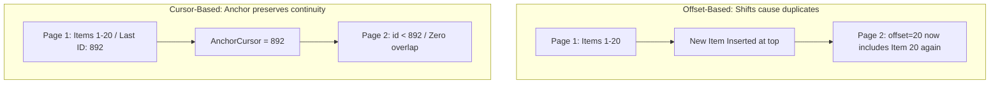

# Mobile System Design: Pagination & List Virtualization

This document outlines the client-side system design for dynamic pagination, scrolling optimizations, and list rendering inside modern mobile applications (e.g. Flutter `ListView.builder` or Android `RecyclerView` / Jetpack Compose `LazyColumn`).

---

## 1. Pagination Strategies: Offset vs. Cursor

When loading large sets of structured data (e.g., social media feeds), the client must choose between two primary pagination mechanisms:

### 1. Offset-Based Pagination (`LIMIT X OFFSET Y`)
* **How It Works**: The client queries the database or API for page 3 using an offset: `GET /feed?limit=20&offset=40`.
* **The Pitfall**: 
  * **Inconsistent Lists (Duplicate/Missing Items)**: If a new post is added to the top of the feed while a user is scrolling, all item indices shift down. When the client loads the next page using `offset=20`, the last item of page 1 will be fetched again at the top of page 2, resulting in duplicated UI items.
  * **Database Degradation**: On the server, `OFFSET 100000` requires the database to scan through 100,000 records and discard them before returning the requested 20, leading to poor query times.

### 2. Cursor-Based Pagination (Highly Recommended)
* **How It Works**: The client requests the next batch of items *after* the last processed item's unique identifier: `GET /feed?limit=20&after_id=892`.
* **Why it Wins**:
  * **Perfect Consistency**: No matter how many items are inserted or deleted at the top of the list, `after_id` acts as a static anchor point. The next batch starts precisely where the anchor points, completely preventing duplicate or missed items.
  * **Scalable DB Queries**: The server runs an efficient indexed query: `SELECT * FROM posts WHERE id < 892 ORDER BY id DESC LIMIT 20`, yielding instant execution times even for deep page indices.

---

## 2. Prefetching & Viewport Optimization

To deliver a flawless user experience, mobile apps must prefetch data *before* the user reaches the absolute bottom of the screen.

### The Trigger Boundary (Dynamic Prefetching)
* **Design**: Do not listen for `isAtBottom == true`. This forces the user to wait for a loading spinner.
* **Prefetch Window**: Monitor viewport scroll offsets. If the user scrolls past **80% of the currently loaded list height**, trigger the network request to fetch the next page in the background.
* **Double-Fetch Protection**: Maintain a boolean flag `isFetchingNextPage`. If `true`, suppress incoming scroll triggers until the current request resolves, avoiding duplicate network payloads.

---

## 3. List State Preservation & Memory Management

Virtualizing massive feeds requires balancing RAM limits with visual continuity:

1. **Cell Replay & Virtualization**: The UI rendering framework (Compose `LazyColumn` or Flutter `ListView.builder`) only instantiates UI widgets that are currently visible in the active viewport (plus a minor cache buffer). When a widget scrolls off screen, its UI element is recycled for the next arriving widget, maintaining flat memory usage.
2. **State Preservation**: When a cell is recycled, its internal UI states (e.g. video playback positions, text-field entries) are destroyed.
   * **Solution**: Ensure all cell state (e.g. scroll offsets, text-field states) is decoupled from the UI view and persisted in a ViewModel or local DB.
3. **Optimistic Updates**: When a user updates a post (e.g., toggling a "Like" button), mutate the local database record immediately. Since the list observes the DB query, only the targeted cell reconstructs, avoiding full screen redraws and protecting GPU performance.
