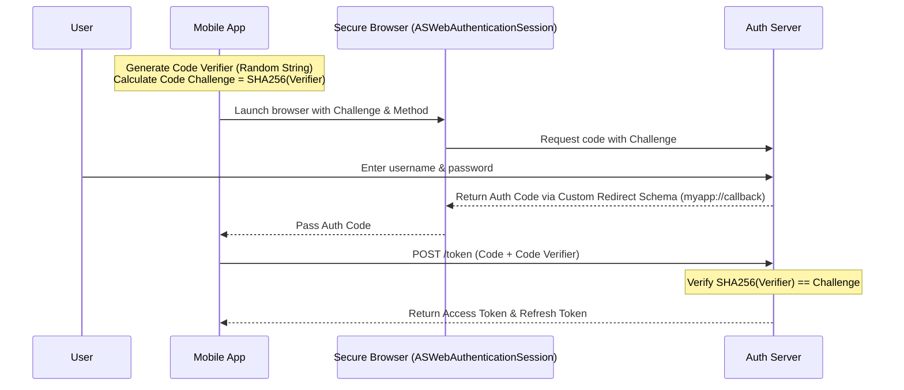
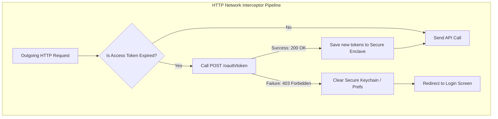

# Mobile System Design: Secure Session Management

This document describes the client-side system design for secure user session persistence, Token Refresh Rotation, and hardware-backed credential storage.

---

## 1. OAuth 2.0 with PKCE (Proof Key for Code Exchange)

Mobile apps are public clients (they cannot securely hide a client secret in compile-time code). To authenticate securely against authorization servers, mobile clients must use **OAuth 2.0 with PKCE**:

---

## 2. Secure Local Storage: Hardware Encapsulation

Once authentication tokens (Access Token, Refresh Token) are received, they must never be saved as plain text inside local databases or shared preferences, as rooted/jailbroken devices can extract them.

### Secure Client-Side Storage Mechanisms

#### 1. iOS Keychain
* **How it works**: A secure, OS-level database for storing small, critical chunks of sensitive data.
* **Hardware Protection**: Encrypted using hardware-backed cryptographic keys inside Apple's **Secure Enclave**.
* **Attributes**: Configure access limits (e.g. `kSecAttrAccessibleAfterFirstUnlockThisDeviceOnly`) to block access until the phone is unlocked.

#### 2. Android EncryptedSharedPreferences (Keystore)
* **How it works**: Part of Android Jetpack Security. Wraps standard SharedPreferences in an automatic encryption layer.
* **Hardware Protection**: Automatically generates two-tier keys:
  * **Master Key**: Generated and managed inside Android's **Hardware-Backed Keystore** (TEE - Trusted Execution Environment or StrongBox).
  * **Sub-key**: Used to encrypt the shared preference XML file using AES-256-GCM.

---

## 3. JWT Token Refresh Rotation & Auto-Logout

Access tokens have short lifetimes (e.g., 1 hour) to minimize damage if leaked. Refresh tokens have long lifetimes (e.g., 30 days).

### Automatic Token Refresh Pipeline
1. **API Call**: The client performs a standard network request.
2. **Expired State**: If the Access Token has expired, the server returns an **HTTP 401 Unauthorized** error.
3. **Intercept & Hold**: The client's HTTP network interceptor catches the 401. It blocks the active request queue and launches a token refresh call: `POST /oauth/token` containing the `refresh_token`.
4. **Resubmit**: 
   * **Success**: The backend returns a new Access Token & a new Refresh Token (Refresh Token Rotation). The client saves them to secure storage, updates the interceptor headers, and automatically replays the blocked request queue. The user experiences zero UI friction.
   * **Failure**: If the refresh token is expired or has been revoked (e.g., a secondary login invalidated the session), the server returns an HTTP 403 Forbidden. The client must instantly trigger a global logout: clear secure storage and redirect the user to the login screen.

